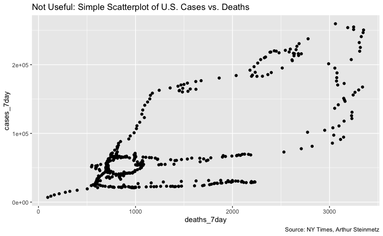
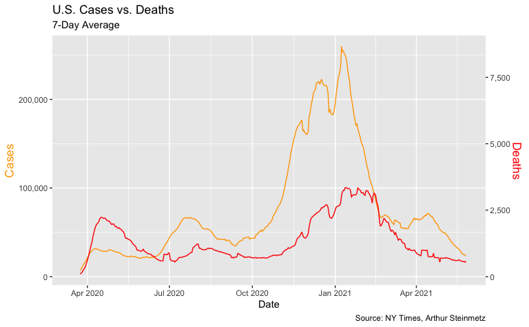
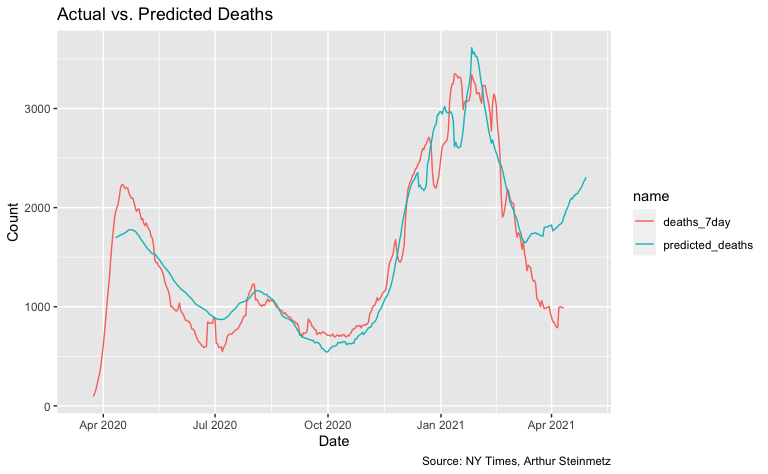
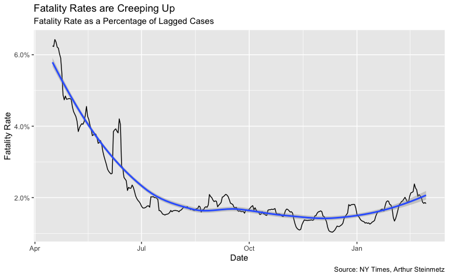
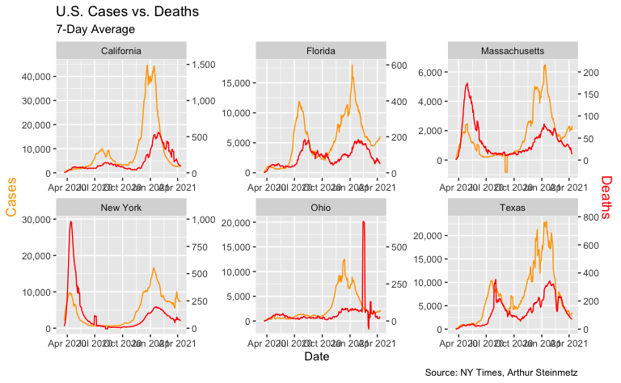
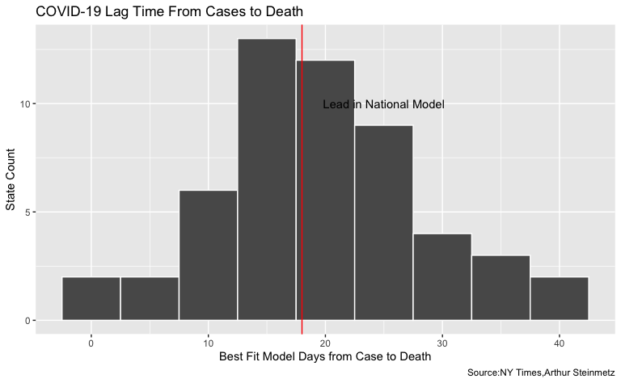

Exploring US COVID-19 Cases and Deaths - Up to Current Time
================
H. David Shea
2021-02-11

This is code from the RStudio blog of Arthur Steinmetz’s exploration of
COVID-19 cases and deaths, from 2020-12-23 titled [*Exploring US
COVID-19 Cases and
Deaths*](https://blog.rstudio.com/2020/12/23/exploring-us-covid-19-cases/).
In the original blog, Art cropped the data to match those in his article
at [*Outsider Data
Science*](https://outsiderdata.netlify.app/post/covid-cases-vs-deaths/).
In this code, the data run up to 7 days ago (as recent data are not
always complete.)

NY Times COVID-19 Data

``` r
knitr::opts_chunk$set(echo = TRUE, eval = TRUE)

# correlate deaths and cases by state
library(tidyverse)
library(timetk)
library(lubridate)
library(broom)
library(knitr)

# source https://github.com/nytimes/covid-19-data.git
us_states_long <- read.csv("https://raw.githubusercontent.com/nytimes/covid-19-data/master/us-states.csv", 
                           col.names = c("date","location","fips","cases_total","deaths_total"),
                           colClasses = c("Date","character","integer","double","double"))

# use data from November 15 to stay consistent with text narrative
cutoff_start <- as.Date("2020-03-15") # not widespread enough until then
cutoff_end <- max(us_states_long$date) - 7 # discard last week since there are reporting lags

us_states_long <- us_states_long %>% filter(date >= cutoff_start)
us_states_long <- us_states_long %>% filter(date <= cutoff_end)
territories <- c("Guam", "Northern Mariana Islands") # Remove tiny territories
us_states_long <- us_states_long %>% filter(!(location %in% territories))
save(us_states_long, file = "us_states_long.rdata")
us_states_long %>%
  head() %>%
  kable()
```

| date       | location   | fips | cases\_total | deaths\_total |
|:-----------|:-----------|-----:|-------------:|--------------:|
| 2020-03-15 | Alabama    |    1 |           23 |             0 |
| 2020-03-15 | Alaska     |    2 |            1 |             0 |
| 2020-03-15 | Arizona    |    4 |           13 |             0 |
| 2020-03-15 | Arkansas   |    5 |           16 |             0 |
| 2020-03-15 | California |    6 |          478 |             6 |
| 2020-03-15 | Colorado   |    8 |          136 |             2 |

NY Times COVID-19 Data with 7 day moving average cases and deaths

``` r
# Create rolling average changes
us_states <- us_states_long %>%
  rename(state = location) %>%
  select(date, state, cases_total, deaths_total) %>%
  mutate(state = as_factor(state)) %>%
  arrange(state, date) %>%
  group_by(state) %>%
  # smooth the data with 7 day moving average
  mutate(cases_7day = (cases_total - lag(cases_total, 7)) / 7) %>%
  mutate(deaths_7day = (deaths_total - lag(deaths_total, 7)) / 7)

# national analysis
# ----------------------------------------------
# aggregate state to national
us <- us_states %>%
  group_by(date) %>%
  summarize(across(
    .cols = where(is.double),
    .fns = function(x) sum(x),
    .names = "{col}"
  ))

us[10:20, ] %>%
  kable()
```

| date       | cases\_total | deaths\_total | cases\_7day | deaths\_7day |
|:-----------|-------------:|--------------:|------------:|-------------:|
| 2020-03-24 |        53906 |           784 |    6857.571 |     95.28571 |
| 2020-03-25 |        68540 |          1053 |    8599.714 |    127.28571 |
| 2020-03-26 |        85521 |          1352 |   10448.571 |    162.85714 |
| 2020-03-27 |       102847 |          1769 |   12121.286 |    213.14286 |
| 2020-03-28 |       123907 |          2299 |   14199.143 |    277.00000 |
| 2020-03-29 |       142426 |          2717 |   15625.714 |    322.85714 |
| 2020-03-30 |       163893 |          3367 |   17202.429 |    398.42857 |
| 2020-03-31 |       188320 |          4302 |   19202.000 |    502.57143 |
| 2020-04-01 |       215238 |          5321 |   20956.857 |    609.71429 |
| 2020-04-02 |       244948 |          6537 |   22775.286 |    740.71429 |
| 2020-04-03 |       277264 |          7927 |   24916.714 |    879.71429 |

Exploratory data analyses

``` r
# does a simple scatterplot tell us anything
# about the relationship of deaths to cases? No.
g <- us %>%
  ggplot(aes(deaths_7day, cases_7day)) +
  geom_point() +
  labs(
    title = "Not Useful: Simple Scatterplot of U.S. Cases vs. Deaths",
    caption = "Source: NY Times, Arthur Steinmetz"
  )
show(g)
```



``` r
# visualize the relationship between rolling average of weekly cases and deaths
coeff <- 30
g <- us %>%
  ggplot(aes(date, cases_7day)) +
  geom_line(color = "orange") +
  theme(legend.position = "none") +
  geom_line(aes(x = date, y = deaths_7day * coeff), color = "red") +
  scale_y_continuous(
    labels = scales::comma,
    name = "Cases",
    sec.axis = sec_axis(deaths_7day ~ . / coeff,
      name = "Deaths",
      labels = scales::comma
    )
  ) +
  theme(
    axis.title.y = element_text(color = "orange", size = 13),
    axis.title.y.right = element_text(color = "red", size = 13)
  ) +
  labs(
    title = "U.S. Cases vs. Deaths",
    subtitle = "7-Day Average",
    caption = "Source: NY Times, Arthur Steinmetz",
    x = "Date"
  )
show(g)
```



## Modeling Cases versus Deaths

``` r
# passage of time affects deaths more than cases
lm(deaths_7day ~ cases_7day + date, data = us) %>%
  tidy() %>%
  kable()
```

| term        |      estimate |    std.error |  statistic |   p.value |
|:------------|--------------:|-------------:|-----------:|----------:|
| (Intercept) | -2477.3137929 | 6221.7637673 | -0.3981691 | 0.6907286 |
| cases\_7day |     0.0086281 |    0.0005817 | 14.8331342 | 0.0000000 |
| date        |     0.1745406 |    0.3371035 |  0.5177657 | 0.6049223 |

``` r
# create columns for deaths led 0 to 40 days ahead
max_lead <- 40
us_lags <- us %>%
  # create lags by day
  tk_augment_lags(deaths_7day, .lags = 0:-max_lead, .names = "auto")
# fix names to remove minus sign
names(us_lags) <- names(us_lags) %>% str_replace_all("lag-|lag", "lead")

# use only case dates where we have complete future knowledge of deaths for all lead times.
us_lags <- us_lags %>% filter(date < cutoff_end - max_lead)

us_lags[1:10, 1:7] %>%
  kable()
```

| date       | cases\_total | deaths\_total | cases\_7day | deaths\_7day | deaths\_7day\_lead0 | deaths\_7day\_lead1 |
|:-----------|-------------:|--------------:|------------:|-------------:|--------------------:|--------------------:|
| 2020-03-15 |         3597 |            68 |          NA |           NA |                  NA |                  NA |
| 2020-03-16 |         4504 |            91 |          NA |           NA |                  NA |                  NA |
| 2020-03-17 |         5903 |           117 |          NA |           NA |                  NA |                  NA |
| 2020-03-18 |         8342 |           162 |          NA |           NA |                  NA |                  NA |
| 2020-03-19 |        12381 |           212 |          NA |           NA |                  NA |                  NA |
| 2020-03-20 |        17998 |           277 |          NA |           NA |                  NA |                  NA |
| 2020-03-21 |        24513 |           360 |          NA |           NA |                  NA |                  NA |
| 2020-03-22 |        33046 |           457 |          NA |           NA |                  NA |                  NA |
| 2020-03-23 |        43476 |           578 |          NA |           NA |                  NA |            95.28571 |
| 2020-03-24 |        53906 |           784 |    6857.571 |     95.28571 |            95.28571 |           127.28571 |

``` r
# make long form to nest
# initialize models data frame
models <- us_lags %>%
  ungroup() %>%
  pivot_longer(
    cols = contains("lead"),
    names_to = "lead",
    values_to = "led_deaths"
  ) %>%
  select(date, cases_7day, lead, led_deaths) %>%
  mutate(lead = as.numeric(str_remove(lead, "deaths_7day_lead"))) %>%
  nest(data = c(date, cases_7day, led_deaths)) %>%
  # Run a regression on lagged cases and date vs deaths
  mutate(model = map(
    data,
    function(df) {
      lm(led_deaths ~ cases_7day + poly(date, 2), data = df)
    }
  ))

# Add regression coefficient
# get adjusted r squared
models <- models %>%
  mutate(adj_r = map(model, function(x) {
    glance(x) %>%
      pull(adj.r.squared)
  })
  %>% unlist())
print(models)
#> # A tibble: 41 x 4
#>     lead data                   model  adj_r
#>    <dbl> <list>                 <list> <dbl>
#>  1     0 <tibble[,3] [352 × 3]> <lm>   0.773
#>  2     1 <tibble[,3] [352 × 3]> <lm>   0.790
#>  3     2 <tibble[,3] [352 × 3]> <lm>   0.805
#>  4     3 <tibble[,3] [352 × 3]> <lm>   0.819
#>  5     4 <tibble[,3] [352 × 3]> <lm>   0.833
#>  6     5 <tibble[,3] [352 × 3]> <lm>   0.846
#>  7     6 <tibble[,3] [352 × 3]> <lm>   0.858
#>  8     7 <tibble[,3] [352 × 3]> <lm>   0.868
#>  9     8 <tibble[,3] [352 × 3]> <lm>   0.878
#> 10     9 <tibble[,3] [352 × 3]> <lm>   0.887
#> # … with 31 more rows
```

``` r
# Show model fit by lead time
# make predictions using best model
best_fit <- models %>%
  summarize(adj_r = max(adj_r)) %>%
  left_join(models, by = "adj_r")

g <- models %>%
  ggplot(aes(lead, adj_r)) +
  geom_line() +
  labs(
    subtitle = paste("Best fit lead =", best_fit$lead, "days"),
    title = "Model Fit By Lag Days",
    x = "Lead Time in Days for Deaths",
    caption = "Source: NY Times, Arthur Steinmetz",
    y = "Adjusted R-squared"
  )
show(g)
```


``` r
best_fit$model[[1]] %>% 
  tidy() %>%
  kable()
```

| term           |      estimate |   std.error | statistic | p.value |
|:---------------|--------------:|------------:|----------:|--------:|
| (Intercept)    |   536.1631581 |  28.5208819 |  18.79897 |       0 |
| cases\_7day    |     0.0122374 |   0.0003091 |  39.59688 |       0 |
| poly(date, 2)1 | -4519.4721373 | 400.2499002 | -11.29163 |       0 |
| poly(date, 2)2 |  6791.9225593 | 271.2624893 |  25.03819 |       0 |

``` r
# ------------------------------------------
# see how well our model predicts
# Function to create prediction plot
show_predictions <- function(single_model, n.ahead) {
  predicted_deaths <- predict(single_model$model[[1]], newdata = us)
  date <- seq.Date(from = min(us$date) + n.ahead, to = max(us$date) + n.ahead, by = 1)
  display <- full_join(us, tibble(date, predicted_deaths))

  gg <- display %>%
    pivot_longer(cols = where(is.numeric)) %>%
    filter(name %in% c("deaths_7day", "predicted_deaths")) %>%
    ggplot(aes(date, value, color = name)) +
    geom_line() +
    labs(
      title = "Actual vs. Predicted Deaths",
      x = "Date",
      y = "Count",
      caption = "Source: NY Times, Arthur Steinmetz"
    )
  gg
}
show_predictions(best_fit, best_fit$lead)
```



``` r
fatality <- best_fit$data[[1]] %>%
  filter(cases_7day > 0) %>%
  filter(date > as.Date("2020-04-15")) %>%
  mutate(rate = led_deaths / cases_7day)

g <- fatality %>% ggplot(aes(date, rate)) +
  geom_line() +
  geom_smooth() +
  labs(
    x = "Date", y = "Fatality Rate",
    title = "Fatality Rates are Creeping Up",
    subtitle = "Fatality Rate as a Percentage of Lagged Cases",
    caption = "Source: NY Times, Arthur Steinmetz"
  ) +
  scale_y_continuous(labels = scales::percent)
show(g)
```



``` r
# ------------------------------------------
# state by state analysis

state_subset <- c("New York", "Texas", "California", "Ohio", "Florida", "Massachusetts")

# illustrate selected states
g <- us_states %>%
  filter(state %in% state_subset) %>%
  ggplot(aes(date, cases_7day)) +
  geom_line(color = "orange") +
  facet_wrap(~state, scales = "free") +
  theme(legend.position = "none") +
  geom_line(aes(y = deaths_7day * coeff), color = "red") +
  scale_y_continuous(
    labels = scales::comma,
    name = "Cases",
    sec.axis = sec_axis(deaths_7day ~ . / coeff,
      name = "Deaths",
      labels = scales::comma
    )
  ) +
  theme(
    axis.title.y = element_text(color = "orange", size = 13),
    axis.title.y.right = element_text(color = "red", size = 13)
  ) +
  labs(
    title = "U.S. Cases vs. Deaths",
    subtitle = "7-Day Average",
    caption = "Source: NY Times, Arthur Steinmetz",
    x = "Date"
  )
show(g)
```



``` r
# create lags
us_states_lags <- us_states %>%
  # create lags by day
  tk_augment_lags(deaths_7day, .lags = -max_lead:0, .names = "auto")
# fix names to remove minus sign
names(us_states_lags) <- names(us_states_lags) %>% str_replace_all("lag-", "lead")

# make long form to nest
# initialize models data frame
models_st <- us_states_lags %>%
  ungroup() %>%
  pivot_longer(
    cols = contains("lead"),
    names_to = "lead",
    values_to = "led_deaths"
  ) %>%
  select(state, date, cases_7day, lead, led_deaths) %>%
  mutate(lead = as.numeric(str_remove(lead, "deaths_7day_lead")))

# make separate tibbles for each regression
models_st <- models_st %>%
  nest(data = c(date, cases_7day, led_deaths)) %>%
  arrange(lead)

# Run a linear regression on lagged cases and date vs deaths
models_st <- models_st %>%
  mutate(model = map(
    data,
    function(df) {
      lm(led_deaths ~ cases_7day + poly(date, 2), data = df)
    }
  ))


# Add regression coefficient
# get adjusted r squared
models_st <- models_st %>%
  mutate(adj_r = map(model, function(x) {
    glance(x) %>%
      pull(adj.r.squared)
  })
  %>% unlist())

g <- models_st %>%
  filter(state %in% state_subset) %>%
  ggplot(aes(lead, adj_r)) +
  geom_line() +
  facet_wrap(~state) +
  labs(
    title = "Best Fit Lead Time",
    caption = "Source: NY Times, Arthur Steinmetz"
  )
show(g)
```


``` r
# best fit lag by state
best_fit_st <- models_st %>%
  group_by(state) %>%
  summarize(adj_r = max(adj_r)) %>%
  left_join(models_st)

g <- best_fit_st %>% ggplot(aes(adj_r)) +
  geom_histogram(bins = 10, color = "white") +
  geom_vline(xintercept = best_fit$adj_r[[1]], color = "red") +
  annotate(geom = "text", x = 0.75, y = 18, label = "Adj-R in National Model") +
  labs(
    y = "State Count",
    x = "Adjusted R-Squared",
    title = "Goodness of Fit of State Models",
    caption = "Source:NY Times,Arthur Steinmetz"
  )
show(g)
```


``` r
g <- best_fit_st %>% ggplot(aes(lead)) +
  geom_histogram(binwidth = 5, color = "white") +
  scale_y_continuous(labels = scales::label_number(accuracy = 1)) +
  geom_vline(xintercept = best_fit$lead[[1]], color = "red") +
  annotate(geom = "text", x = best_fit$lead[[1]] + 7, y = 10, label = "Lead in National Model") +
  labs(
    y = "State Count",
    x = "Best Fit Model Days from Case to Death",
    title = "COVID-19 Lag Time From Cases to Death",
    caption = "Source:NY Times,Arthur Steinmetz"
  )
show(g)
```



``` r
# ----------------------------------------------------
best_fit_st %>%
  select(-data, -model) %>%
  filter(state == "Ohio") %>%
  kable()
```

| state |    adj\_r | lead |
|:------|----------:|-----:|
| Ohio  | 0.2093096 |   35 |

``` r
# source: https://coronavirus.ohio.gov/static/dashboards/COVIDSummaryData.csv
ohio_raw <- read_csv("https://coronavirus.ohio.gov/static/dashboards/COVIDSummaryData.csv",
  col_types = cols(
    `Admission Date` = col_date(format = "%m/%d/%Y"),
    `Date Of Death` = col_date(format = "%m/%d/%Y"),
    `Onset Date` = col_date(format = "%m/%d/%Y")
  )
)

# helper function to fix column names to best practice
fix_df_colnames <- function(df) {
  names(df) <- names(df) %>%
    str_replace_all(c(" " = "_", "," = "")) %>%
    tolower()
  return(df)
}

# clean up the data
ohio <- ohio_raw %>%
  rename(death_count = `Death Due to Illness Count`) %>%
  filter(County != "Grand Total") %>%
  fix_df_colnames() %>%
  # data not clean before middle of march
  filter(onset_date >= cutoff_start)
```

``` r
# create rolling average function
mean_roll_7 <- slidify(mean, .period = 7, .align = "right")

comps <- ohio %>%
  group_by(onset_date) %>%
  summarise(OH = sum(case_count), .groups = "drop") %>%
  mutate(OH = mean_roll_7(OH)) %>%
  ungroup() %>%
  mutate(state = "Ohio") %>%
  rename(date = onset_date) %>%
  left_join(us_states, by = c("date", "state")) %>%
  transmute(date, OH, NYTimes = cases_7day)

g <- comps %>%
  pivot_longer(c("OH", "NYTimes"), names_to = "source", values_to = "count") %>%
  ggplot(aes(date, count, color = source)) +
  geom_line() +
  labs(
    title = "Case Counts from Different Sources",
    caption = "Source: State of Ohio, NY Times",
    subtitle = "NY Times and State of Ohio",
    x = "Date",
    y = "Daily Case Count (7-day Rolling Average)"
  )
show(g)
```


``` r
# aggregate the data to weekly
ohio <- ohio %>%
  mutate(
    onset_to_death = as.numeric(date_of_death - onset_date),
    onset_year = year(onset_date),
    onset_week = epiweek(onset_date)
  )

onset_to_death <- ohio %>%
  filter(death_count > 0) %>%
  group_by(onset_year, onset_week) %>%
  summarise(
    death_count_sum = sum(death_count),
    mean_onset_to_death = weighted.mean(onset_to_death,
      death_count,
      na.rm = TRUE
    )
  ) %>%
  mutate(date = as.Date(paste(onset_year, onset_week, 1), "%Y %U %u"))

g <- onset_to_death %>% ggplot(aes(date, death_count_sum)) +
  geom_col() +
  labs(
    title = "Ohio Weekly Deaths",
    caption = "Source: State of Ohio, Arthur Steinmetz",
    subtitle = "Based on Illness Onset Date",
    x = "Date of Illness Onset",
    y = "Deaths"
  )
show(g)
```


``` r
# helper function to annotate plots
pos_index <- function(index_vec, fraction) {
  return(index_vec[round(length(index_vec) * fraction)])
}

avg_lag <- round(mean(onset_to_death$mean_onset_to_death))

onset_to_death %>% ggplot(aes(date, mean_onset_to_death)) +
  geom_col() +
  geom_hline(yintercept = avg_lag) +
  annotate(
    geom = "text",
    label = paste("Average Lag =", round(avg_lag)),
    y = 20, x = pos_index(onset_to_death$date, .8)
  ) +
  labs(
    x = "Onset Date",
    y = "Mean Onset to Death",
    title = "Ohio Days from Illness Onset Until Death Over Time",
    caption = "Source: State of Ohio, Arthur Steinmetz",
    subtitle = paste(
      "Average =",
      avg_lag, "Days"
    )
  )
```


``` r
ohio_fatality_rate <- ohio %>%
  group_by(onset_date) %>%
  summarize(
    case_count = sum(case_count),
    death_count = sum(death_count), .groups = "drop"
  ) %>%
  mutate(fatality_rate = death_count / case_count) %>%
  mutate(fatality_rate_7day = mean_roll_7(fatality_rate)) %>%
  # filter out most recent cases we we don't know outcome yet
  filter(onset_date < max(onset_date) - 30)

ohio_fatality_rate %>%
  filter(onset_date > as.Date("2020-04-15")) %>%
  ggplot(aes(onset_date, fatality_rate_7day)) +
  geom_line() +
  geom_smooth() +
  labs(
    x = "Illness Onset Date", y = "Ohio Fatality Rate",
    caption = "Source: State of Ohio, Arthur Steinmetz",
    title = "Ohio Fatality Rate as a Percentage of Tracked Cases"
  ) +
  scale_y_continuous(labels = scales::percent, breaks = seq(0, 0.12, by = .01))
```


