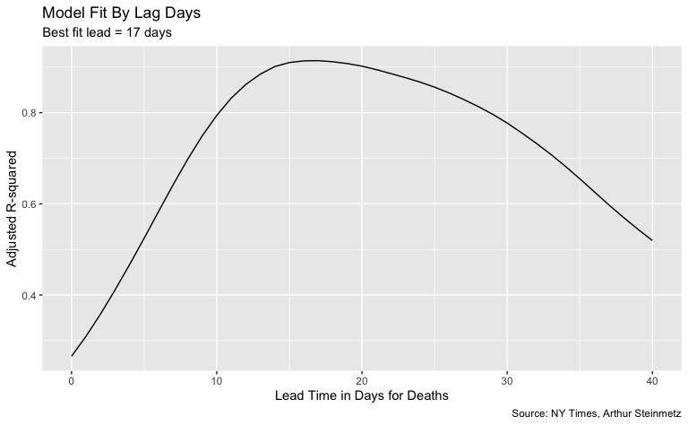
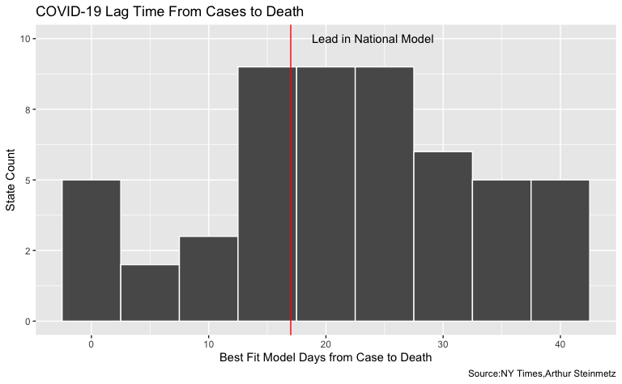

Exploring US COVID-19 Cases and Deaths
================
H. David Shea
2021-02-09

This is the original code from the RStudio blog of Arthur Steinmetz’s
exploration of COVID-19 cases and deaths, from 2020-12-23 titled
[*Exploring US COVID-19 Cases and
Deaths*](https://blog.rstudio.com/2020/12/23/exploring-us-covid-19-cases/).
(Note that the setup chunk is not from the original code, but are my
preferences for knitr.)

Art’s analysis is broken down into three major parts:

-   Understanding the data
-   Modeling cases versus deaths
-   Validating the model against individual case data

## Understanding the Data

Art uses the NY Times COVID tracking data set which is updated daily. In
Art’s original analysis, he referenced a package `covid19nytimes` to
access the COVID-19 data from the [NY
Times](https://github.com/nytimes/covid-19-data.git). That package,
however, has been removed from the CRAN repository (“for policy
violation”). I have cloned the Github repository referenced above and
have replaced the data load calls in Art’s code with direct references
to my local version of the data.

``` r
knitr::opts_chunk$set(echo = TRUE, eval = TRUE)

# correlate deaths and cases by state
library(tidyverse)
# - removed - library(covid19nytimes)
library(timetk)
library(lubridate)
library(broom)
library(knitr)
library(gt)

table_style <- list(cell_text(font = "Arial", size = "small"))

# source https://github.com/nytimes/covid-19-data.git
# - replaced - us_states_long <- covid19nytimes::refresh_covid19nytimes_states()
us_states_long <- read.csv("../covid-19-data/us-states.csv", 
                           col.names = c("date","location","fips","cases_total","deaths_total"),
                           colClasses = c("Date","character","integer","double","double"))

# The following filter is to restrict the data to that originally posted at
# https://outsiderdata.netlify.app/post/covid-cases-vs-deaths/
# Should you wish to update the models with the latest data, remove the
# following statement.
us_states_long <- us_states_long %>% filter(date < ymd("2020-12-06"))

# if link is broken
# load("../data/us_states_long.rdata")

# use data from November 15 to stay consistent with text narrative
cutoff_start <- as.Date("2020-03-15") # not widespread enough until then
cutoff_end <- max(us_states_long$date) - 7 # discard last week since there are reporting lags

us_states_long <- us_states_long %>% filter(date >= cutoff_start)
us_states_long <- us_states_long %>% filter(date <= cutoff_end)
# Remove tiny territories
territories <- c("Guam", "Northern Mariana Islands")
us_states_long <- us_states_long %>% filter(!(location %in% territories))
save(us_states_long, file = "us_states_long.rdata")
us_states_long %>%
  head() %>%
  gt() %>%
  tab_options(table.width = "100%") %>%
  tab_style(style = table_style, 
            locations = cells_body()) %>% 
  opt_all_caps()
```

<<<<<<< HEAD
=======
</style>
>>>>>>> e35f267af5b00a796660502ec716ae5c43755051
<div id="jfmidjsdye" style="overflow-x:auto;overflow-y:auto;width:auto;height:auto;"><table class="gt_table">
  
  <thead class="gt_col_headings">
    <tr>
      <th class="gt_col_heading gt_columns_bottom_border gt_left" rowspan="1" colspan="1">date</th>
      <th class="gt_col_heading gt_columns_bottom_border gt_left" rowspan="1" colspan="1">location</th>
      <th class="gt_col_heading gt_columns_bottom_border gt_center" rowspan="1" colspan="1">fips</th>
      <th class="gt_col_heading gt_columns_bottom_border gt_right" rowspan="1" colspan="1">cases_total</th>
      <th class="gt_col_heading gt_columns_bottom_border gt_right" rowspan="1" colspan="1">deaths_total</th>
    </tr>
  </thead>
  <tbody class="gt_table_body">
    <tr>
      <td class="gt_row gt_left" style="font-family: Arial; font-size: small;">2020-03-15</td>
      <td class="gt_row gt_left" style="font-family: Arial; font-size: small;">Alabama</td>
      <td class="gt_row gt_center" style="font-family: Arial; font-size: small;">1</td>
      <td class="gt_row gt_right" style="font-family: Arial; font-size: small;">23</td>
      <td class="gt_row gt_right" style="font-family: Arial; font-size: small;">0</td>
    </tr>
    <tr>
      <td class="gt_row gt_left" style="font-family: Arial; font-size: small;">2020-03-15</td>
      <td class="gt_row gt_left" style="font-family: Arial; font-size: small;">Alaska</td>
      <td class="gt_row gt_center" style="font-family: Arial; font-size: small;">2</td>
      <td class="gt_row gt_right" style="font-family: Arial; font-size: small;">1</td>
      <td class="gt_row gt_right" style="font-family: Arial; font-size: small;">0</td>
    </tr>
    <tr>
      <td class="gt_row gt_left" style="font-family: Arial; font-size: small;">2020-03-15</td>
      <td class="gt_row gt_left" style="font-family: Arial; font-size: small;">Arizona</td>
      <td class="gt_row gt_center" style="font-family: Arial; font-size: small;">4</td>
      <td class="gt_row gt_right" style="font-family: Arial; font-size: small;">13</td>
      <td class="gt_row gt_right" style="font-family: Arial; font-size: small;">0</td>
    </tr>
    <tr>
      <td class="gt_row gt_left" style="font-family: Arial; font-size: small;">2020-03-15</td>
      <td class="gt_row gt_left" style="font-family: Arial; font-size: small;">Arkansas</td>
      <td class="gt_row gt_center" style="font-family: Arial; font-size: small;">5</td>
      <td class="gt_row gt_right" style="font-family: Arial; font-size: small;">16</td>
      <td class="gt_row gt_right" style="font-family: Arial; font-size: small;">0</td>
    </tr>
    <tr>
      <td class="gt_row gt_left" style="font-family: Arial; font-size: small;">2020-03-15</td>
      <td class="gt_row gt_left" style="font-family: Arial; font-size: small;">California</td>
      <td class="gt_row gt_center" style="font-family: Arial; font-size: small;">6</td>
      <td class="gt_row gt_right" style="font-family: Arial; font-size: small;">478</td>
      <td class="gt_row gt_right" style="font-family: Arial; font-size: small;">6</td>
    </tr>
    <tr>
      <td class="gt_row gt_left" style="font-family: Arial; font-size: small;">2020-03-15</td>
      <td class="gt_row gt_left" style="font-family: Arial; font-size: small;">Colorado</td>
      <td class="gt_row gt_center" style="font-family: Arial; font-size: small;">8</td>
      <td class="gt_row gt_right" style="font-family: Arial; font-size: small;">136</td>
      <td class="gt_row gt_right" style="font-family: Arial; font-size: small;">2</td>
    </tr>
  </tbody>
  
  
</table></div>

Here Art wrangles the raw data to add in 7-day rolling cases and deaths
counts. The data directly from the NY Times site is not in the same
format as the data from the original `covid19nytimes` package that Art
used, so I have modified the original code to reflect those changes
(notated in the comments below).

Art also aggregates up to a national level in a new data set `us` and
reports those totals.

``` r
# Create rolling average changes
# pivot wider
# this will also be needed when we create lags
us_states <- us_states_long %>%
  # discard dates before cases were tracked.
  filter(date > as.Date("2020-03-01")) %>%
  # - removed - pivot_wider(names_from = "data_type", values_from = "value") %>%
  rename(state = location) %>%
  select(date, state, cases_total, deaths_total) %>%
  mutate(state = as_factor(state)) %>%
  arrange(state, date) %>%
  group_by(state) %>%
  # smooth the data with 7 day moving average
  mutate(cases_7day = (cases_total - lag(cases_total, 7)) / 7) %>%
  mutate(deaths_7day = (deaths_total - lag(deaths_total, 7)) / 7)

# national analysis
# ----------------------------------------------
# aggregate state to national
us <- us_states %>%
  group_by(date) %>%
  summarize(across(
    .cols = where(is.double),
    .fns = function(x) sum(x, na.rm = T),
    .names = "{col}"
  ))

us[10:20, ] %>%
  gt() %>%
  tab_options(table.width = "80%") %>%
  tab_style(style = table_style, 
            locations = cells_body()) %>% 
  opt_all_caps()
```

<div id="miunxvhuox" style="overflow-x:auto;overflow-y:auto;width:auto;height:auto;"><table class="gt_table">
  
  <thead class="gt_col_headings">
    <tr>
      <th class="gt_col_heading gt_columns_bottom_border gt_left" rowspan="1" colspan="1">date</th>
      <th class="gt_col_heading gt_columns_bottom_border gt_right" rowspan="1" colspan="1">cases_total</th>
      <th class="gt_col_heading gt_columns_bottom_border gt_right" rowspan="1" colspan="1">deaths_total</th>
      <th class="gt_col_heading gt_columns_bottom_border gt_right" rowspan="1" colspan="1">cases_7day</th>
      <th class="gt_col_heading gt_columns_bottom_border gt_right" rowspan="1" colspan="1">deaths_7day</th>
    </tr>
  </thead>
  <tbody class="gt_table_body">
    <tr>
      <td class="gt_row gt_left" style="font-family: Arial; font-size: small;">2020-03-24</td>
      <td class="gt_row gt_right" style="font-family: Arial; font-size: small;">53906</td>
      <td class="gt_row gt_right" style="font-family: Arial; font-size: small;">784</td>
      <td class="gt_row gt_right" style="font-family: Arial; font-size: small;">6857.571</td>
      <td class="gt_row gt_right" style="font-family: Arial; font-size: small;">95.28571</td>
    </tr>
    <tr>
      <td class="gt_row gt_left" style="font-family: Arial; font-size: small;">2020-03-25</td>
      <td class="gt_row gt_right" style="font-family: Arial; font-size: small;">68540</td>
      <td class="gt_row gt_right" style="font-family: Arial; font-size: small;">1053</td>
      <td class="gt_row gt_right" style="font-family: Arial; font-size: small;">8599.714</td>
      <td class="gt_row gt_right" style="font-family: Arial; font-size: small;">127.28571</td>
    </tr>
    <tr>
      <td class="gt_row gt_left" style="font-family: Arial; font-size: small;">2020-03-26</td>
      <td class="gt_row gt_right" style="font-family: Arial; font-size: small;">85521</td>
      <td class="gt_row gt_right" style="font-family: Arial; font-size: small;">1352</td>
      <td class="gt_row gt_right" style="font-family: Arial; font-size: small;">10448.571</td>
      <td class="gt_row gt_right" style="font-family: Arial; font-size: small;">162.85714</td>
    </tr>
    <tr>
      <td class="gt_row gt_left" style="font-family: Arial; font-size: small;">2020-03-27</td>
      <td class="gt_row gt_right" style="font-family: Arial; font-size: small;">102847</td>
      <td class="gt_row gt_right" style="font-family: Arial; font-size: small;">1769</td>
      <td class="gt_row gt_right" style="font-family: Arial; font-size: small;">12121.286</td>
      <td class="gt_row gt_right" style="font-family: Arial; font-size: small;">213.14286</td>
    </tr>
    <tr>
      <td class="gt_row gt_left" style="font-family: Arial; font-size: small;">2020-03-28</td>
      <td class="gt_row gt_right" style="font-family: Arial; font-size: small;">123907</td>
      <td class="gt_row gt_right" style="font-family: Arial; font-size: small;">2299</td>
      <td class="gt_row gt_right" style="font-family: Arial; font-size: small;">14199.143</td>
      <td class="gt_row gt_right" style="font-family: Arial; font-size: small;">277.00000</td>
    </tr>
    <tr>
      <td class="gt_row gt_left" style="font-family: Arial; font-size: small;">2020-03-29</td>
      <td class="gt_row gt_right" style="font-family: Arial; font-size: small;">142426</td>
      <td class="gt_row gt_right" style="font-family: Arial; font-size: small;">2717</td>
      <td class="gt_row gt_right" style="font-family: Arial; font-size: small;">15625.714</td>
      <td class="gt_row gt_right" style="font-family: Arial; font-size: small;">322.85714</td>
    </tr>
    <tr>
      <td class="gt_row gt_left" style="font-family: Arial; font-size: small;">2020-03-30</td>
      <td class="gt_row gt_right" style="font-family: Arial; font-size: small;">163893</td>
      <td class="gt_row gt_right" style="font-family: Arial; font-size: small;">3367</td>
      <td class="gt_row gt_right" style="font-family: Arial; font-size: small;">17202.429</td>
      <td class="gt_row gt_right" style="font-family: Arial; font-size: small;">398.42857</td>
    </tr>
    <tr>
      <td class="gt_row gt_left" style="font-family: Arial; font-size: small;">2020-03-31</td>
      <td class="gt_row gt_right" style="font-family: Arial; font-size: small;">188320</td>
      <td class="gt_row gt_right" style="font-family: Arial; font-size: small;">4302</td>
      <td class="gt_row gt_right" style="font-family: Arial; font-size: small;">19202.000</td>
      <td class="gt_row gt_right" style="font-family: Arial; font-size: small;">502.57143</td>
    </tr>
    <tr>
      <td class="gt_row gt_left" style="font-family: Arial; font-size: small;">2020-04-01</td>
      <td class="gt_row gt_right" style="font-family: Arial; font-size: small;">215238</td>
      <td class="gt_row gt_right" style="font-family: Arial; font-size: small;">5321</td>
      <td class="gt_row gt_right" style="font-family: Arial; font-size: small;">20956.857</td>
      <td class="gt_row gt_right" style="font-family: Arial; font-size: small;">609.71429</td>
    </tr>
    <tr>
      <td class="gt_row gt_left" style="font-family: Arial; font-size: small;">2020-04-02</td>
      <td class="gt_row gt_right" style="font-family: Arial; font-size: small;">244948</td>
      <td class="gt_row gt_right" style="font-family: Arial; font-size: small;">6537</td>
      <td class="gt_row gt_right" style="font-family: Arial; font-size: small;">22775.286</td>
      <td class="gt_row gt_right" style="font-family: Arial; font-size: small;">740.71429</td>
    </tr>
    <tr>
      <td class="gt_row gt_left" style="font-family: Arial; font-size: small;">2020-04-03</td>
      <td class="gt_row gt_right" style="font-family: Arial; font-size: small;">277264</td>
      <td class="gt_row gt_right" style="font-family: Arial; font-size: small;">7927</td>
      <td class="gt_row gt_right" style="font-family: Arial; font-size: small;">24916.714</td>
      <td class="gt_row gt_right" style="font-family: Arial; font-size: small;">879.71429</td>
    </tr>
  </tbody>
  
  
</table></div>

In the following chunks, Art does some exploratory data analyses.

``` r
# does a simple scatterplot tell us anything
# about the relationship of deaths to cases? No.
g <- us %>%
  ggplot(aes(deaths_7day, cases_7day)) +
  geom_point() +
  labs(
    title = "Not Useful: Simple Scatterplot of U.S. Cases vs. Deaths",
    caption = "Source: NY Times, Arthur Steinmetz"
  )
show(g)
```


``` r
# visualize the relationship between rolling average of weekly cases and deaths
coeff <- 30
g <- us %>%
  ggplot(aes(date, cases_7day)) +
  geom_line(color = "orange") +
  theme(legend.position = "none") +
  geom_line(aes(x = date, y = deaths_7day * coeff), color = "red") +
  scale_y_continuous(
    labels = scales::comma,
    name = "Cases",
    sec.axis = sec_axis(deaths_7day ~ . / coeff,
      name = "Deaths",
      labels = scales::comma
    )
  ) +
  theme(
    axis.title.y = element_text(color = "orange", size = 13),
    axis.title.y.right = element_text(color = "red", size = 13)
  ) +
  labs(
    title = "U.S. Cases vs. Deaths",
    subtitle = "7-Day Average",
    caption = "Source: NY Times, Arthur Steinmetz",
    x = "Date"
  )
show(g)
```


This is Art’s original commentary on the chart above from the blog:

> We can get much more insight plotting smoothed deaths and cases over
> time. It is generally bad form to use two different y axes on a single
> plot but this example adds insight.

> A couple of observations are obvious. First when cases start to rise,
> deaths follow with a lag. Second, we have had three spikes in cases so
> far and in each successive instance the mortality has risen by a
> smaller amount. This suggests that, thankfully, we are getting better
> at treating this disease. It is NOT a function of increased testing
> because positivity rates have not been falling.

## Modeling Cases versus Deaths

Art comments that a problem to consider for modeling is "it looks like
the more cases surge, the less the impact on deaths. This is NOT a valid
conclusion. A simple regression of deaths vs. cases and time shows the
passage of time has more explanatory power than cases in predicting
deaths so we have to take that into account.

``` r
# passage of time affects deaths more than cases
lm(deaths_7day ~ cases_7day + date, data = us) %>%
  tidy() %>%
  gt() %>% 
  tab_options(table.width = "60%") %>%
  tab_style(style = table_style, 
            locations = cells_body()) %>% 
  opt_all_caps()
```

<div id="rtyrdlbwgb" style="overflow-x:auto;overflow-y:auto;width:auto;height:auto;"><table class="gt_table">
  
  <thead class="gt_col_headings">
    <tr>
      <th class="gt_col_heading gt_columns_bottom_border gt_left" rowspan="1" colspan="1">term</th>
      <th class="gt_col_heading gt_columns_bottom_border gt_right" rowspan="1" colspan="1">estimate</th>
      <th class="gt_col_heading gt_columns_bottom_border gt_right" rowspan="1" colspan="1">std.error</th>
      <th class="gt_col_heading gt_columns_bottom_border gt_right" rowspan="1" colspan="1">statistic</th>
      <th class="gt_col_heading gt_columns_bottom_border gt_right" rowspan="1" colspan="1">p.value</th>
    </tr>
  </thead>
  <tbody class="gt_table_body">
    <tr>
      <td class="gt_row gt_left" style="font-family: Arial; font-size: small;">(Intercept)</td>
      <td class="gt_row gt_right" style="font-family: Arial; font-size: small;">7.653143e+04</td>
      <td class="gt_row gt_right" style="font-family: Arial; font-size: small;">1.005355e+04</td>
      <td class="gt_row gt_right" style="font-family: Arial; font-size: small;">7.612381</td>
      <td class="gt_row gt_right" style="font-family: Arial; font-size: small;">5.176390e-13</td>
    </tr>
    <tr>
      <td class="gt_row gt_left" style="font-family: Arial; font-size: small;">cases_7day</td>
      <td class="gt_row gt_right" style="font-family: Arial; font-size: small;">8.277406e-03</td>
      <td class="gt_row gt_right" style="font-family: Arial; font-size: small;">1.117389e-03</td>
      <td class="gt_row gt_right" style="font-family: Arial; font-size: small;">7.407811</td>
      <td class="gt_row gt_right" style="font-family: Arial; font-size: small;">1.862453e-12</td>
    </tr>
    <tr>
      <td class="gt_row gt_left" style="font-family: Arial; font-size: small;">date</td>
      <td class="gt_row gt_right" style="font-family: Arial; font-size: small;">-4.112224e+00</td>
      <td class="gt_row gt_right" style="font-family: Arial; font-size: small;">5.467092e-01</td>
      <td class="gt_row gt_right" style="font-family: Arial; font-size: small;">-7.521777</td>
      <td class="gt_row gt_right" style="font-family: Arial; font-size: small;">9.150367e-13</td>
    </tr>
  </tbody>
  
  
</table></div>

His solution is to run regression models of deaths and varying leads of
cases. He chooses to lead deaths as opposed to lagging cases because it
will allow him to make predictions about the future of deaths given
cases today. (Note that in the `tk_augment_lags` function call below
there is a `-` in front of max\_lead. This is how he finnagles the lag
function to create leads.)

``` r
# create columns for deaths led 0 to 40 days ahead
max_lead <- 40
us_lags <- us %>%
  # create lags by day
  tk_augment_lags(deaths_7day, .lags = 0:-max_lead, .names = "auto")
# fix names to remove minus sign
names(us_lags) <- names(us_lags) %>% str_replace_all("lag-|lag", "lead")

# use only case dates where we have complete future knowledge of deaths for all lead times.
us_lags <- us_lags %>% filter(date < cutoff_end - max_lead)

us_lags[1:10, 1:7] %>%
  gt() %>% 
  tab_options(table.width = "100%") %>%
  tab_style(style = table_style, 
            locations = cells_body()) %>% 
  opt_all_caps()
```

<div id="fzuwvfkcrq" style="overflow-x:auto;overflow-y:auto;width:auto;height:auto;"><table class="gt_table">
  
  <thead class="gt_col_headings">
    <tr>
      <th class="gt_col_heading gt_columns_bottom_border gt_left" rowspan="1" colspan="1">date</th>
      <th class="gt_col_heading gt_columns_bottom_border gt_right" rowspan="1" colspan="1">cases_total</th>
      <th class="gt_col_heading gt_columns_bottom_border gt_right" rowspan="1" colspan="1">deaths_total</th>
      <th class="gt_col_heading gt_columns_bottom_border gt_right" rowspan="1" colspan="1">cases_7day</th>
      <th class="gt_col_heading gt_columns_bottom_border gt_right" rowspan="1" colspan="1">deaths_7day</th>
      <th class="gt_col_heading gt_columns_bottom_border gt_right" rowspan="1" colspan="1">deaths_7day_lead0</th>
      <th class="gt_col_heading gt_columns_bottom_border gt_right" rowspan="1" colspan="1">deaths_7day_lead1</th>
    </tr>
  </thead>
  <tbody class="gt_table_body">
    <tr>
      <td class="gt_row gt_left" style="font-family: Arial; font-size: small;">2020-03-15</td>
      <td class="gt_row gt_right" style="font-family: Arial; font-size: small;">3597</td>
      <td class="gt_row gt_right" style="font-family: Arial; font-size: small;">68</td>
      <td class="gt_row gt_right" style="font-family: Arial; font-size: small;">0.000</td>
      <td class="gt_row gt_right" style="font-family: Arial; font-size: small;">0.00000</td>
      <td class="gt_row gt_right" style="font-family: Arial; font-size: small;">0.00000</td>
      <td class="gt_row gt_right" style="font-family: Arial; font-size: small;">0.00000</td>
    </tr>
    <tr>
      <td class="gt_row gt_left" style="font-family: Arial; font-size: small;">2020-03-16</td>
      <td class="gt_row gt_right" style="font-family: Arial; font-size: small;">4504</td>
      <td class="gt_row gt_right" style="font-family: Arial; font-size: small;">91</td>
      <td class="gt_row gt_right" style="font-family: Arial; font-size: small;">0.000</td>
      <td class="gt_row gt_right" style="font-family: Arial; font-size: small;">0.00000</td>
      <td class="gt_row gt_right" style="font-family: Arial; font-size: small;">0.00000</td>
      <td class="gt_row gt_right" style="font-family: Arial; font-size: small;">0.00000</td>
    </tr>
    <tr>
      <td class="gt_row gt_left" style="font-family: Arial; font-size: small;">2020-03-17</td>
      <td class="gt_row gt_right" style="font-family: Arial; font-size: small;">5903</td>
      <td class="gt_row gt_right" style="font-family: Arial; font-size: small;">117</td>
      <td class="gt_row gt_right" style="font-family: Arial; font-size: small;">0.000</td>
      <td class="gt_row gt_right" style="font-family: Arial; font-size: small;">0.00000</td>
      <td class="gt_row gt_right" style="font-family: Arial; font-size: small;">0.00000</td>
      <td class="gt_row gt_right" style="font-family: Arial; font-size: small;">0.00000</td>
    </tr>
    <tr>
      <td class="gt_row gt_left" style="font-family: Arial; font-size: small;">2020-03-18</td>
      <td class="gt_row gt_right" style="font-family: Arial; font-size: small;">8342</td>
      <td class="gt_row gt_right" style="font-family: Arial; font-size: small;">162</td>
      <td class="gt_row gt_right" style="font-family: Arial; font-size: small;">0.000</td>
      <td class="gt_row gt_right" style="font-family: Arial; font-size: small;">0.00000</td>
      <td class="gt_row gt_right" style="font-family: Arial; font-size: small;">0.00000</td>
      <td class="gt_row gt_right" style="font-family: Arial; font-size: small;">0.00000</td>
    </tr>
    <tr>
      <td class="gt_row gt_left" style="font-family: Arial; font-size: small;">2020-03-19</td>
      <td class="gt_row gt_right" style="font-family: Arial; font-size: small;">12381</td>
      <td class="gt_row gt_right" style="font-family: Arial; font-size: small;">212</td>
      <td class="gt_row gt_right" style="font-family: Arial; font-size: small;">0.000</td>
      <td class="gt_row gt_right" style="font-family: Arial; font-size: small;">0.00000</td>
      <td class="gt_row gt_right" style="font-family: Arial; font-size: small;">0.00000</td>
      <td class="gt_row gt_right" style="font-family: Arial; font-size: small;">0.00000</td>
    </tr>
    <tr>
      <td class="gt_row gt_left" style="font-family: Arial; font-size: small;">2020-03-20</td>
      <td class="gt_row gt_right" style="font-family: Arial; font-size: small;">17998</td>
      <td class="gt_row gt_right" style="font-family: Arial; font-size: small;">277</td>
      <td class="gt_row gt_right" style="font-family: Arial; font-size: small;">0.000</td>
      <td class="gt_row gt_right" style="font-family: Arial; font-size: small;">0.00000</td>
      <td class="gt_row gt_right" style="font-family: Arial; font-size: small;">0.00000</td>
      <td class="gt_row gt_right" style="font-family: Arial; font-size: small;">0.00000</td>
    </tr>
    <tr>
      <td class="gt_row gt_left" style="font-family: Arial; font-size: small;">2020-03-21</td>
      <td class="gt_row gt_right" style="font-family: Arial; font-size: small;">24513</td>
      <td class="gt_row gt_right" style="font-family: Arial; font-size: small;">360</td>
      <td class="gt_row gt_right" style="font-family: Arial; font-size: small;">0.000</td>
      <td class="gt_row gt_right" style="font-family: Arial; font-size: small;">0.00000</td>
      <td class="gt_row gt_right" style="font-family: Arial; font-size: small;">0.00000</td>
      <td class="gt_row gt_right" style="font-family: Arial; font-size: small;">55.57143</td>
    </tr>
    <tr>
      <td class="gt_row gt_left" style="font-family: Arial; font-size: small;">2020-03-22</td>
      <td class="gt_row gt_right" style="font-family: Arial; font-size: small;">33046</td>
      <td class="gt_row gt_right" style="font-family: Arial; font-size: small;">457</td>
      <td class="gt_row gt_right" style="font-family: Arial; font-size: small;">4204.714</td>
      <td class="gt_row gt_right" style="font-family: Arial; font-size: small;">55.57143</td>
      <td class="gt_row gt_right" style="font-family: Arial; font-size: small;">55.57143</td>
      <td class="gt_row gt_right" style="font-family: Arial; font-size: small;">69.57143</td>
    </tr>
    <tr>
      <td class="gt_row gt_left" style="font-family: Arial; font-size: small;">2020-03-23</td>
      <td class="gt_row gt_right" style="font-family: Arial; font-size: small;">43476</td>
      <td class="gt_row gt_right" style="font-family: Arial; font-size: small;">578</td>
      <td class="gt_row gt_right" style="font-family: Arial; font-size: small;">5565.143</td>
      <td class="gt_row gt_right" style="font-family: Arial; font-size: small;">69.57143</td>
      <td class="gt_row gt_right" style="font-family: Arial; font-size: small;">69.57143</td>
      <td class="gt_row gt_right" style="font-family: Arial; font-size: small;">95.28571</td>
    </tr>
    <tr>
      <td class="gt_row gt_left" style="font-family: Arial; font-size: small;">2020-03-24</td>
      <td class="gt_row gt_right" style="font-family: Arial; font-size: small;">53906</td>
      <td class="gt_row gt_right" style="font-family: Arial; font-size: small;">784</td>
      <td class="gt_row gt_right" style="font-family: Arial; font-size: small;">6857.571</td>
      <td class="gt_row gt_right" style="font-family: Arial; font-size: small;">95.28571</td>
      <td class="gt_row gt_right" style="font-family: Arial; font-size: small;">95.28571</td>
      <td class="gt_row gt_right" style="font-family: Arial; font-size: small;">127.28571</td>
    </tr>
  </tbody>
  
  
</table></div>

Now he builds linear models and seeing the real power of the tidymodels
framework. Since we have our lead days in columns we revert back to
long-form data. For each date we have a case count and 40 lead days with
the corresponding death count.

His workflow looks like this:

-   Create the lags (leads) using tk\_augment\_lag (see above).
-   Pivot to long form.
-   Nest the data by lead day and state.
-   Map the data set for each lead day to a regression model.
-   Pull out the adjusted R-Squared using glance for each model to
    determine the best fit lead time.

``` r
# make long form to nest
# initialize models data frame
models <- us_lags %>%
  ungroup() %>%
  pivot_longer(
    cols = contains("lead"),
    names_to = "lead",
    values_to = "led_deaths"
  ) %>%
  select(date, cases_7day, lead, led_deaths) %>%
  mutate(lead = as.numeric(str_remove(lead, "deaths_7day_lead"))) %>%
  nest(data = c(date, cases_7day, led_deaths)) %>%
  # Run a regression on lagged cases and date vs deaths
  mutate(model = map(
    data,
    function(df) {
      lm(led_deaths ~ cases_7day + poly(date, 2), data = df)
    }
  ))

# Add regression coefficient
# get adjusted r squared
models <- models %>%
  mutate(adj_r = map(model, function(x) {
    glance(x) %>%
      pull(adj.r.squared)
  })
  %>% unlist())
print(models)
#> # A tibble: 41 x 4
#>     lead data                   model  adj_r
#>    <dbl> <list>                 <list> <dbl>
#>  1     0 <tibble[,3] [218 × 3]> <lm>   0.164
#>  2     1 <tibble[,3] [218 × 3]> <lm>   0.187
#>  3     2 <tibble[,3] [218 × 3]> <lm>   0.212
#>  4     3 <tibble[,3] [218 × 3]> <lm>   0.241
#>  5     4 <tibble[,3] [218 × 3]> <lm>   0.272
#>  6     5 <tibble[,3] [218 × 3]> <lm>   0.307
#>  7     6 <tibble[,3] [218 × 3]> <lm>   0.343
#>  8     7 <tibble[,3] [218 × 3]> <lm>   0.383
#>  9     8 <tibble[,3] [218 × 3]> <lm>   0.424
#> 10     9 <tibble[,3] [218 × 3]> <lm>   0.467
#> # … with 31 more rows
```

The result above is a data frame with lead times, the nested raw data,
model and R-squared for each lead time.

He choose the model with the highest R-squared as the best-fit lead
time.

``` r
# Show model fit by lead time
# make predictions using best model
best_fit <- models %>%
  summarize(adj_r = max(adj_r)) %>%
  left_join(models, by = "adj_r")

g <- models %>%
  ggplot(aes(lead, adj_r)) +
  geom_line() +
  labs(
    subtitle = paste("Best fit lead =", best_fit$lead, "days"),
    title = "Model Fit By Lag Days",
    x = "Lead Time in Days for Deaths",
    caption = "Source: NY Times, Arthur Steinmetz",
    y = "Adjusted R-squared"
  )
show(g)
```



He determines that he is not overfitting the date variable because the
significance of the case count remains. “With a high enough degree
polynomial on the date variable, cases would vanish in importance.”

``` r
best_fit$model[[1]] %>% 
  tidy() %>% 
  gt() %>% 
  tab_options(table.width = "80%") %>%
  tab_style(style = table_style, 
            locations = cells_body()) %>% 
  opt_all_caps()
```

<div id="gjcwsyxbfi" style="overflow-x:auto;overflow-y:auto;width:auto;height:auto;"><table class="gt_table">
  
  <thead class="gt_col_headings">
    <tr>
      <th class="gt_col_heading gt_columns_bottom_border gt_left" rowspan="1" colspan="1">term</th>
      <th class="gt_col_heading gt_columns_bottom_border gt_right" rowspan="1" colspan="1">estimate</th>
      <th class="gt_col_heading gt_columns_bottom_border gt_right" rowspan="1" colspan="1">std.error</th>
      <th class="gt_col_heading gt_columns_bottom_border gt_right" rowspan="1" colspan="1">statistic</th>
      <th class="gt_col_heading gt_columns_bottom_border gt_right" rowspan="1" colspan="1">p.value</th>
    </tr>
  </thead>
  <tbody class="gt_table_body">
    <tr>
      <td class="gt_row gt_left" style="font-family: Arial; font-size: small;">(Intercept)</td>
      <td class="gt_row gt_right" style="font-family: Arial; font-size: small;">4.363549e+02</td>
      <td class="gt_row gt_right" style="font-family: Arial; font-size: small;">3.798413e+01</td>
      <td class="gt_row gt_right" style="font-family: Arial; font-size: small;">11.48782</td>
      <td class="gt_row gt_right" style="font-family: Arial; font-size: small;">4.163504e-24</td>
    </tr>
    <tr>
      <td class="gt_row gt_left" style="font-family: Arial; font-size: small;">cases_7day</td>
      <td class="gt_row gt_right" style="font-family: Arial; font-size: small;">1.668541e-02</td>
      <td class="gt_row gt_right" style="font-family: Arial; font-size: small;">9.924621e-04</td>
      <td class="gt_row gt_right" style="font-family: Arial; font-size: small;">16.81214</td>
      <td class="gt_row gt_right" style="font-family: Arial; font-size: small;">5.422361e-41</td>
    </tr>
    <tr>
      <td class="gt_row gt_left" style="font-family: Arial; font-size: small;">poly(date, 2)1</td>
      <td class="gt_row gt_right" style="font-family: Arial; font-size: small;">-7.305211e+03</td>
      <td class="gt_row gt_right" style="font-family: Arial; font-size: small;">2.269860e+02</td>
      <td class="gt_row gt_right" style="font-family: Arial; font-size: small;">-32.18353</td>
      <td class="gt_row gt_right" style="font-family: Arial; font-size: small;">5.884348e-84</td>
    </tr>
    <tr>
      <td class="gt_row gt_left" style="font-family: Arial; font-size: small;">poly(date, 2)2</td>
      <td class="gt_row gt_right" style="font-family: Arial; font-size: small;">4.511714e+03</td>
      <td class="gt_row gt_right" style="font-family: Arial; font-size: small;">1.673881e+02</td>
      <td class="gt_row gt_right" style="font-family: Arial; font-size: small;">26.95361</td>
      <td class="gt_row gt_right" style="font-family: Arial; font-size: small;">9.924578e-71</td>
    </tr>
  </tbody>
  
  
</table></div>

Next, he uses `predict` to see how well the model fits to the actual
deaths.

``` r
# ------------------------------------------
# see how well our model predicts
# Function to create prediction plot
show_predictions <- function(single_model, n.ahead) {
  predicted_deaths <- predict(single_model$model[[1]], newdata = us)
  date <- seq.Date(from = min(us$date) + n.ahead, to = max(us$date) + n.ahead, by = 1)
  display <- full_join(us, tibble(date, predicted_deaths))

  gg <- display %>%
    pivot_longer(cols = where(is.numeric)) %>%
    filter(name %in% c("deaths_7day", "predicted_deaths")) %>%
    ggplot(aes(date, value, color = name)) +
    geom_line() +
    labs(
      title = "Actual vs. Predicted Deaths",
      x = "Date",
      y = "Count",
      caption = "Source: NY Times, Arthur Steinmetz"
    )
  gg
}
show_predictions(best_fit, best_fit$lead)
```


Art’s comments on the above outcome:

> This is a satisfying result, but sadly shows deaths about to spike.
> This is despite accounting for the improvements in treatment outcomes
> we’ve accomplished over the past several months. The 23-day lead time
> model shows a 1.7% mortality rate over the whole length of
> observations but conditioned on deaths falling steadily over time.

To understand the declining mortality rate, Art looks at the *fatality
rate per identified case*. He comments that “\[t\]his is but one
possible measure of fatality rate, certainly not THE fatality rate.
Testing rate, positivity rate and others variables will affect this
measure.” He also cautions that because he assumes that the best-fit lag
is stable over time, we should take “the result with a grain of salt.”

In order to minimize the impact off much more focused testing in the
early part of the pandemic (compared to much broader testing now), he
start his measure of fatality rate as a percent of lagged cases at the
middle of April.

``` r
fatality <- best_fit$data[[1]] %>%
  filter(cases_7day > 0) %>%
  filter(date > as.Date("2020-04-15")) %>%
  mutate(rate = led_deaths / cases_7day)

g <- fatality %>% ggplot(aes(date, rate)) +
  geom_line() +
  geom_smooth() +
  labs(
    x = "Date", y = "Fatality Rate",
    title = "Fatality Rates are Creeping Up",
    subtitle = "Fatality Rate as a Percentage of Lagged Cases",
    caption = "Source: NY Times, Arthur Steinmetz"
  ) +
  scale_y_continuous(labels = scales::percent)
show(g)
```


Next, he does a state-level analysis because “\[o\]ne problem with the
national model is each state saw the arrival of the virus at different
times, which suggests there might also be different relationships
between cases and deaths.”

The following analysis looks at a few selected states for illustration.

``` r
# ------------------------------------------
# state by state analysis

state_subset <- c("New York", "Texas", "California", "Ohio")

# illustrate selected states
g <- us_states %>%
  filter(state %in% state_subset) %>%
  ggplot(aes(date, cases_7day)) +
  geom_line(color = "orange") +
  facet_wrap(~state, scales = "free") +
  theme(legend.position = "none") +
  geom_line(aes(y = deaths_7day * coeff), color = "red") +
  scale_y_continuous(
    labels = scales::comma,
    name = "Cases",
    sec.axis = sec_axis(deaths_7day ~ . / coeff,
      name = "Deaths",
      labels = scales::comma
    )
  ) +
  theme(
    axis.title.y = element_text(color = "orange", size = 13),
    axis.title.y.right = element_text(color = "red", size = 13)
  ) +
  labs(
    title = "U.S. Cases vs. Deaths",
    subtitle = "7-Day Average",
    caption = "Source: NY Times, Arthur Steinmetz",
    x = "Date"
  )
show(g)
```


Art’s comments on the states shown:

> In particular we note New York, where the virus arrived early and
> circulated undetected for weeks. Testing was rare and we did not know
> much about the course of the disease so the death toll was much worse.
> Tests were often not conducted until the disease was in advanced
> stages so we would expect the lag to be shorter.

> In Texas, the virus arrived later. There it looks like the
> consequences of the first wave were less dire and the lag was longer.

Next, he runs the data leading, regression modeling and best fit
selection for each state and plots the best fit lead times for the
states used as examples above.

``` r
# create lags
us_states_lags <- us_states %>%
  # create lags by day
  tk_augment_lags(deaths_7day, .lags = -max_lead:0, .names = "auto")
# fix names to remove minus sign
names(us_states_lags) <- names(us_states_lags) %>% str_replace_all("lag-", "lead")

# make long form to nest
# initialize models data frame
models_st <- us_states_lags %>%
  ungroup() %>%
  pivot_longer(
    cols = contains("lead"),
    names_to = "lead",
    values_to = "led_deaths"
  ) %>%
  select(state, date, cases_7day, lead, led_deaths) %>%
  mutate(lead = as.numeric(str_remove(lead, "deaths_7day_lead")))

# make separate tibbles for each regression
models_st <- models_st %>%
  nest(data = c(date, cases_7day, led_deaths)) %>%
  arrange(lead)

# Run a linear regression on lagged cases and date vs deaths
models_st <- models_st %>%
  mutate(model = map(
    data,
    function(df) {
      lm(led_deaths ~ cases_7day + poly(date, 2), data = df)
    }
  ))


# Add regression coefficient
# get adjusted r squared
models_st <- models_st %>%
  mutate(adj_r = map(model, function(x) {
    glance(x) %>%
      pull(adj.r.squared)
  })
  %>% unlist())

g <- models_st %>%
  filter(state %in% state_subset) %>%
  ggplot(aes(lead, adj_r)) +
  geom_line() +
  facet_wrap(~state) +
  labs(
    title = "Best Fit Lead Time",
    caption = "Source: NY Times, Arthur Steinmetz"
  )
show(g)
```


Then, he looks at how the fit looks for the state data set as a whole.
He plots a histogram of all the state R-squareds which shows that many
of the state models have a worse accuracy than the national model.

``` r
# best fit lag by state
best_fit_st <- models_st %>%
  group_by(state) %>%
  summarize(adj_r = max(adj_r)) %>%
  left_join(models_st)

g <- best_fit_st %>% ggplot(aes(adj_r)) +
  geom_histogram(bins = 10, color = "white") +
  geom_vline(xintercept = best_fit$adj_r[[1]], color = "red") +
  annotate(geom = "text", x = 0.75, y = 18, label = "Adj-R in National Model") +
  labs(
    y = "State Count",
    x = "Adjusted R-Squared",
    title = "Goodness of Fit of State Models",
    caption = "Source:NY Times,Arthur Steinmetz"
  )
show(g)
```


He notes that “\[t\]here are vast differences in the best-fit lead times
across the states but the distribution is in agreement with our national
model.”

``` r
g <- best_fit_st %>% ggplot(aes(lead)) +
  geom_histogram(binwidth = 5, color = "white") +
  scale_y_continuous(labels = scales::label_number(accuracy = 1)) +
  geom_vline(xintercept = best_fit$lead[[1]], color = "red") +
  annotate(geom = "text", x = best_fit$lead[[1]] + 7, y = 10, label = "Lead in National Model") +
  labs(
    y = "State Count",
    x = "Best Fit Model Days from Case to Death",
    title = "COVID-19 Lag Time From Cases to Death",
    caption = "Source:NY Times,Arthur Steinmetz"
  )
show(g)
```



## Validating the Model against Individual Case Data

Art notes that:

> This whole exercise has involved proxying deaths by time and quantity
> of positive tests. Ideally, we should look at longitudinal data which
> follows each individual. The state of Ohio provides that so we’ll look
> at just this one state to provide a reality check on the foregoing
> analysis. In our proxy model, Ohio shows a best-fit lead time of 31
> days, which is much longer than our national-level model.

``` r
# ----------------------------------------------------
best_fit_st %>%
  select(-data, -model) %>%
  filter(state == "Ohio") %>%
  gt() %>% 
  tab_options(table.width = "50%") %>%
  tab_style(style = table_style, 
            locations = cells_body()) %>% 
  opt_all_caps()
```

<div id="kbqmjeicvp" style="overflow-x:auto;overflow-y:auto;width:auto;height:auto;"><table class="gt_table">
  
  <thead class="gt_col_headings">
    <tr>
      <th class="gt_col_heading gt_columns_bottom_border gt_center" rowspan="1" colspan="1">state</th>
      <th class="gt_col_heading gt_columns_bottom_border gt_right" rowspan="1" colspan="1">adj_r</th>
      <th class="gt_col_heading gt_columns_bottom_border gt_right" rowspan="1" colspan="1">lead</th>
    </tr>
  </thead>
  <tbody class="gt_table_body">
    <tr>
      <td class="gt_row gt_center" style="font-family: Arial; font-size: small;">Ohio</td>
      <td class="gt_row gt_right" style="font-family: Arial; font-size: small;">0.7548416</td>
      <td class="gt_row gt_right" style="font-family: Arial; font-size: small;">31</td>
    </tr>
  </tbody>
  
  
</table></div>

He notes that the NY Times data uses the “case” date - presumably the
date a positive test is recorded. Ohio, however, uses “onset” date - the
date the “illness began.” These dates are not necessarily the same. The
Ohio data are available
[*here*](https://coronavirus.ohio.gov/static/dashboards/COVIDSummaryData.csv).

``` r
# source: https://coronavirus.ohio.gov/static/dashboards/COVIDSummaryData.csv
ohio_raw <- read_csv("https://coronavirus.ohio.gov/static/dashboards/COVIDSummaryData.csv",
  col_types = cols(
    `Admission Date` = col_date(format = "%m/%d/%Y"),
    `Date Of Death` = col_date(format = "%m/%d/%Y"),
    `Onset Date` = col_date(format = "%m/%d/%Y")
  )
)

# helper function to fix column names to best practice
fix_df_colnames <- function(df) {
  names(df) <- names(df) %>%
    str_replace_all(c(" " = "_", "," = "")) %>%
    tolower()
  return(df)
}

# clean up the data
ohio <- ohio_raw %>%
  rename(death_count = `Death Due to Illness Count`) %>%
  filter(County != "Grand Total") %>%
  fix_df_colnames() %>%
  # data not clean before middle of march
  filter(onset_date >= cutoff_start)
```

Next, he compares the data from the state of Ohio to the Ohio data in
the NY Times data set. This requires a bit of wrangling of the data from
the state of Ohio.

``` r
# create rolling average function
mean_roll_7 <- slidify(mean, .period = 7, .align = "right")

comps <- ohio %>%
  group_by(onset_date) %>%
  summarise(OH = sum(case_count), .groups = "drop") %>%
  mutate(OH = mean_roll_7(OH)) %>%
  ungroup() %>%
  mutate(state = "Ohio") %>%
  rename(date = onset_date) %>%
  left_join(us_states, by = c("date", "state")) %>%
  transmute(date, OH, NYTimes = cases_7day)

g <- comps %>%
  pivot_longer(c("OH", "NYTimes"), names_to = "source", values_to = "count") %>%
  ggplot(aes(date, count, color = source)) +
  geom_line() +
  labs(
    title = "Case Counts from Different Sources",
    caption = "Source: State of Ohio, NY Times",
    subtitle = "NY Times and State of Ohio",
    x = "Date",
    y = "Daily Case Count (7-day Rolling Average)"
  )
show(g)
```


Art’s comment:

> We clearly see the numbers line up almost exactly but the Ohio data
> runs about 4 days ahead of the NY Times data.

The Ohio data are individual case data. Art aggregates the data to state
level and filters out the non-death cases in order to look at deaths on
a weekly basis according to the data from the state of Ohio.

``` r
# aggregate the data to weekly
ohio <- ohio %>%
  mutate(
    onset_to_death = as.numeric(date_of_death - onset_date),
    onset_year = year(onset_date),
    onset_week = epiweek(onset_date)
  )

onset_to_death <- ohio %>%
  filter(death_count > 0) %>%
  group_by(onset_year, onset_week) %>%
  summarise(
    death_count_sum = sum(death_count),
    mean_onset_to_death = weighted.mean(onset_to_death,
      death_count,
      na.rm = TRUE
    )
  ) %>%
  mutate(date = as.Date(paste(onset_year, onset_week, 1), "%Y %U %u"))

g <- onset_to_death %>% ggplot(aes(date, death_count_sum)) +
  geom_col() +
  labs(
    title = "Ohio Weekly Deaths",
    caption = "Source: State of Ohio, Arthur Steinmetz",
    subtitle = "Based on Illness Onset Date",
    x = "Date of Illness Onset",
    y = "Deaths"
  )
show(g)
```


(My note: The histogram, as I see it today, does not exactly match -
*rather dramatically, actually* - the histogram in the RStudio blog. We
may be dealing with updated data at this point in time in the data from
the state of Ohio.)

Art now looks at the averages in the onset to death time. He notes that
it has been fairly stable over time, but that “\[u\]nfortunately, it
differs substantially from our proxy model using untracked cases.”

``` r
# helper function to annotate plots
pos_index <- function(index_vec, fraction) {
  return(index_vec[round(length(index_vec) * fraction)])
}

avg_lag <- round(mean(onset_to_death$mean_onset_to_death))

onset_to_death %>% ggplot(aes(date, mean_onset_to_death)) +
  geom_col() +
  geom_hline(yintercept = avg_lag) +
  annotate(
    geom = "text",
    label = paste("Average Lag =", round(avg_lag)),
    y = 20, x = pos_index(onset_to_death$date, .8)
  ) +
  labs(
    x = "Onset Date",
    y = "Mean Onset to Death",
    title = "Ohio Days from Illness Onset Until Death Over Time",
    caption = "Source: State of Ohio, Arthur Steinmetz",
    subtitle = paste(
      "Average =",
      avg_lag, "Days"
    )
  )
```


(My note: This histogram also does not exactly match the histogram in
the RStudio blog. I think we are dealing with data that are being
updated for corrections in the data from the state of Ohio.)

Art’s comments on this analysis:

> Note the drop off at the end of the date range. This is because we
> don’t yet know the outcome of the most recently recorded cases.
> Generally, while we have been successful in lowering the fatality rate
> of this disease, the duration from onset to death for those cases
> which are fatal has not changed much, at least in Ohio.

Art, lastly, looks at the “true” fatality rate as a percent of tracked
cases in Ohio. He notes that “the fatality rate of the more recent cases
is not yet known.” This is “because we don’t yet know the outcome of the
most recently recorded cases.” Because of this and because the data at
the onset is very sparse, he truncates the data set for this analysis

``` r
ohio_fatality_rate <- ohio %>%
  group_by(onset_date) %>%
  summarize(
    case_count = sum(case_count),
    death_count = sum(death_count), .groups = "drop"
  ) %>%
  mutate(fatality_rate = death_count / case_count) %>%
  mutate(fatality_rate_7day = mean_roll_7(fatality_rate)) %>%
  # filter out most recent cases we we don't know outcome yet
  filter(onset_date < max(onset_date) - 30)

ohio_fatality_rate %>%
  filter(onset_date > as.Date("2020-04-15")) %>%
  ggplot(aes(onset_date, fatality_rate_7day)) +
  geom_line() +
  geom_smooth() +
  labs(
    x = "Illness Onset Date", y = "Ohio Fatality Rate",
    caption = "Source: State of Ohio, Arthur Steinmetz",
    title = "Ohio Fatality Rate as a Percentage of Tracked Cases"
  ) +
  scale_y_continuous(labels = scales::percent, breaks = seq(0, 0.12, by = .01))
```


Art’s comments:

> The fatality rate in Ohio seems to have been worse than our national
> model but it is coming down. Again, this result comes from a different
> methodology than our proxy model.

## Conclusion

> Among the vexing aspects of this terrible pandemic is that we don’t
> know what the gold standard is for treatment and prevention. We are
> learning as we go. The good news is we ARE learning. For a data
> analyst the challenge is the evolving relationship of of all of the
> disparate data. Here we have gotten some insight into the duration
> between a positive test and mortality. We can’t have high confidence
> that our proxy model using aggregate cases is strictly accurate
> because the longitudinal data from Ohio shows a different lag. We have
> clearly seen that mortality has been declining but our model suggests
> that death will nonetheless surge along with the autumn surge in
> cases.

> What are the further avenues for modeling? There is a wealth of data
> around behavior and demographics with this disease that we don’t fully
> understand yet. On the analytics side, we might get more sophisticated
> with our modeling. We have only scratched the surface of the
> tidymodels framework and we might apply fancier predictive models than
> linear regression. Is the drop in the fatality rate we saw early in
> the pandemic real? Only people who were actually sick got tested in
> the early days. Now, many positive tests are from asymptomatic people.
> Finally, the disagreement between the case proxy model and the
> longitudinal data in Ohio shows there is more work to be done.

## About Art Steinmetz

Art Steinmetz is the former Chairman, CEO and President of
OppenheimerFunds. After joining the firm in 1986, Art was an analyst,
portfolio manager and Chief Investment Officer. Art was named President
in 2013, CEO in 2014, and, in 2015, Chairman of the firm with $250
billion under management. He stepped down when the firm was folded into
Invesco.

Currently, Art is a private investor located in New York City. He is an
avid amateur data scientist and is active in the R statistical
programming language community.

(Quoted from the RStudio blog.)
