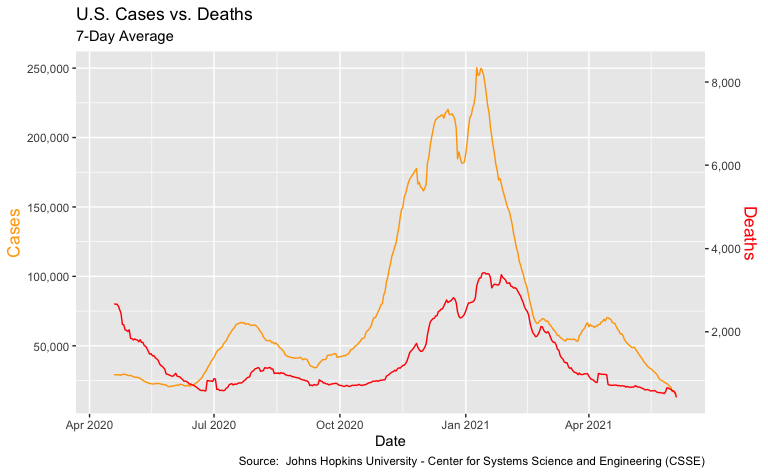
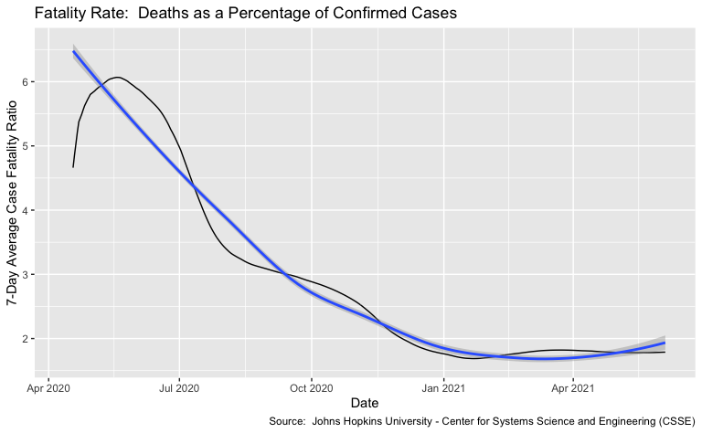
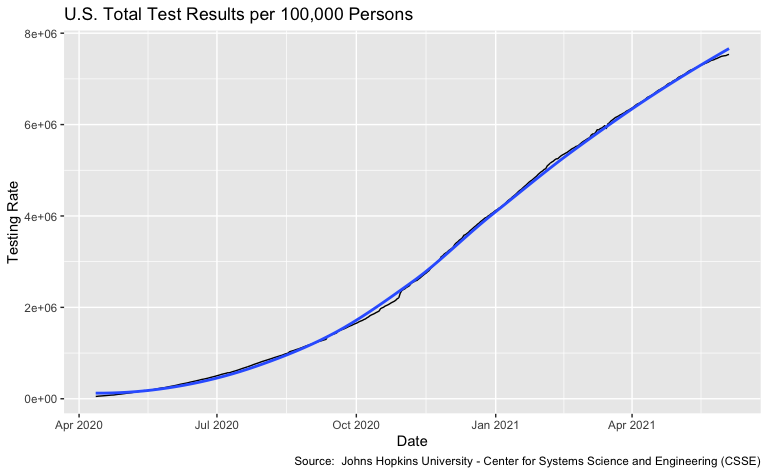
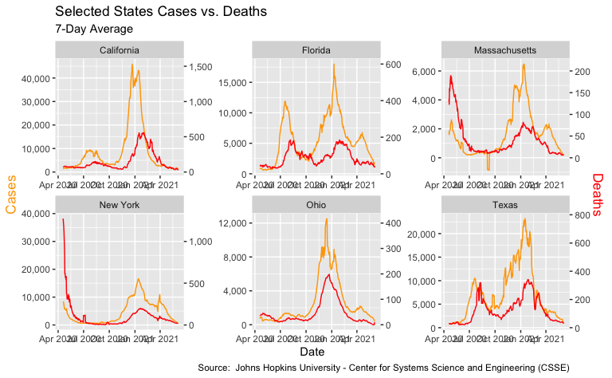

Exploring US COVID-19 Cases and Deaths - Johns Hopkins CSSE Data Sets
================
H. David Shea
2021-02-12

## Johns Hopkins CSSE COVID-19 Data

## Dataset Overview

### Data Sets field descriptions

-   State - The name of the State within the USA.
-   Date - The most recent date the file was pushed.
-   Lat - Latitude.
-   Long\_ - Longitude.
-   Confirmed - Aggregated case count for the state.
-   Deaths - Aggregated death toll for the state.
-   Recovered - Aggregated Recovered case count for the state.
-   Active - Aggregated confirmed cases that have not been resolved
    (Active cases = total cases - total recovered - total deaths).
-   Incident\_Rate - cases per 100,000 persons.
-   Total\_Test\_Results - Total number of people who have been tested.
-   Case\_Fatality\_Ratio - Number recorded deaths \* 100/ Number
    confirmed cases.
-   Testing\_Rate - Total test results per 100,000 persons. The “total
    test results” are equal to “Total test results (Positive +
    Negative)” from COVID Tracking Project.

## Example Data

### National Level Data

| Date       | Confirmed | Deaths | Recovered | Active | Incident\_Rate | Total\_Test\_Results | Testing\_Rate | Confirmed\_7 | Deaths\_7 | Recovered\_7 | Active\_7 | Incident\_Rate\_7 | Total\_Test\_Results\_7 | Testing\_Rate\_7 | Case\_Fatality\_Ratio | Case\_Fatality\_Ratio\_7 |
|:-----------|----------:|-------:|----------:|-------:|---------------:|---------------------:|--------------:|-------------:|----------:|-------------:|----------:|------------------:|------------------------:|-----------------:|----------------------:|-------------------------:|
| 2020-04-12 |    554369 |  22310 |        NA | 532102 |       7218.352 |              2812982 |      51505.05 |           NA |        NA |           NA |        NA |                NA |                      NA |               NA |              4.024395 |                       NA |
| 2020-04-13 |    558617 |  23387 |        NA | 535374 |       7466.461 |              2745533 |      53479.99 |           NA |        NA |           NA |        NA |                NA |                      NA |               NA |              4.186589 |                       NA |
| 2020-04-14 |    627729 |  26671 |        NA | 703142 |       8543.583 |              3286096 |      57900.84 |           NA |        NA |           NA |        NA |                NA |                      NA |               NA |              4.248808 |                       NA |
| 2020-04-15 |    635512 |  28658 |        NA | 606759 |       8334.222 |              3251791 |      59848.39 |           NA |        NA |           NA |        NA |                NA |                      NA |               NA |              4.509435 |                       NA |
| 2020-04-16 |    666737 |  33214 |        NA | 633555 |       8774.668 |              3410091 |      62317.06 |           NA |        NA |           NA |        NA |                NA |                      NA |               NA |              4.981574 |                       NA |
| 2020-04-17 |    698759 |  37086 |        NA | 661580 |       9270.026 |              3550570 |      65075.30 |           NA |        NA |           NA |        NA |                NA |                      NA |               NA |              5.307409 |                       NA |
| 2020-04-18 |    731187 |  38982 |        NA | 692130 |       9748.500 |              3700620 |      67747.25 |           NA |        NA |           NA |        NA |                NA |                      NA |               NA |              5.331331 |                 4.655649 |
| 2020-04-19 |    757924 |  41015 |        NA | 716929 |      10144.696 |              3874988 |      70597.29 |     29079.29 |  2672.143 |           NA |  26403.86 |          418.0492 |                151715.1 |         2727.463 |              5.411492 |                 4.853806 |

### State Level Data

| State   | Date       |     Lat |   Long\_ | Confirmed | Deaths | Recovered | Active | Incident\_Rate | Total\_Test\_Results | Case\_Fatality\_Ratio | Testing\_Rate | Confirmed\_7 | Deaths\_7 | Recovered\_7 | Active\_7 | Incident\_Rate\_7 | Total\_Test\_Results\_7 | Case\_Fatality\_Ratio\_7 | Testing\_Rate\_7 |
|:--------|:-----------|--------:|---------:|----------:|-------:|----------:|-------:|---------------:|---------------------:|----------------------:|--------------:|-------------:|----------:|-------------:|----------:|------------------:|------------------------:|-------------------------:|-----------------:|
| Alabama | 2020-04-12 | 32.3182 | -86.9023 |      3667 |     93 |        NA |   3470 |       75.98802 |                21583 |              2.610160 |      460.3002 |           NA |        NA |           NA |        NA |                NA |                      NA |                       NA |               NA |
| Alabama | 2020-04-13 | 32.3182 | -86.9023 |      3870 |     99 |        NA |   3635 |       79.63493 |                29182 |              2.651312 |      622.3639 |           NA |        NA |           NA |        NA |                NA |                      NA |                       NA |               NA |
| Alabama | 2020-04-14 | 32.3182 | -86.9023 |      4041 |    114 |        NA |   3839 |       84.30554 |                33117 |              2.883886 |      706.2855 |           NA |        NA |           NA |        NA |                NA |                      NA |                       NA |               NA |
| Alabama | 2020-04-15 | 32.3182 | -86.9023 |      4307 |    118 |        NA |   3957 |       86.90743 |                34077 |              2.895706 |      726.7594 |           NA |        NA |           NA |        NA |                NA |                      NA |                       NA |               NA |
| Alabama | 2020-04-16 | 32.3182 | -86.9023 |      4465 |    133 |        NA |   4212 |       92.66572 |                36391 |              3.060990 |      776.1100 |           NA |        NA |           NA |        NA |                NA |                      NA |                       NA |               NA |
| Alabama | 2020-04-17 | 32.3182 | -86.9023 |      4557 |    148 |        NA |   4423 |       97.48561 |                37848 |              3.237804 |      807.1834 |           NA |        NA |           NA |        NA |                NA |                      NA |                       NA |               NA |
| Alabama | 2020-04-18 | 32.3182 | -86.9023 |      4788 |    153 |        NA |   4559 |      100.49272 |                42538 |              3.247029 |      907.2070 |           NA |        NA |           NA |        NA |                NA |                      NA |                 2.940984 |               NA |
| Alabama | 2020-04-19 | 32.3182 | -86.9023 |      4978 |    157 |        NA |   4731 |      104.24627 |                45712 |              3.211948 |      974.8988 |     187.2857 |  9.142857 |           NA |  180.1429 |          4.036892 |                    3447 |                 3.026953 |         73.51409 |

## Exploratory Data Analyses

### US Cases versus Deaths

### US Fatality Ratio - Deaths as a Percent of Confirmed Cases

### US Testing Rate

### Selected States Cases versus Deaths

### Selected States Fatality Ratio - Deaths as a Percent of Confirmed Cases

### Selected States Testing Rate

