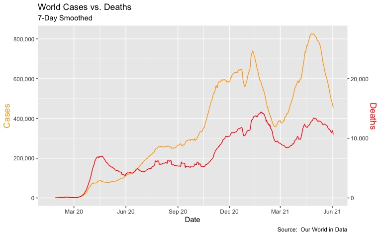
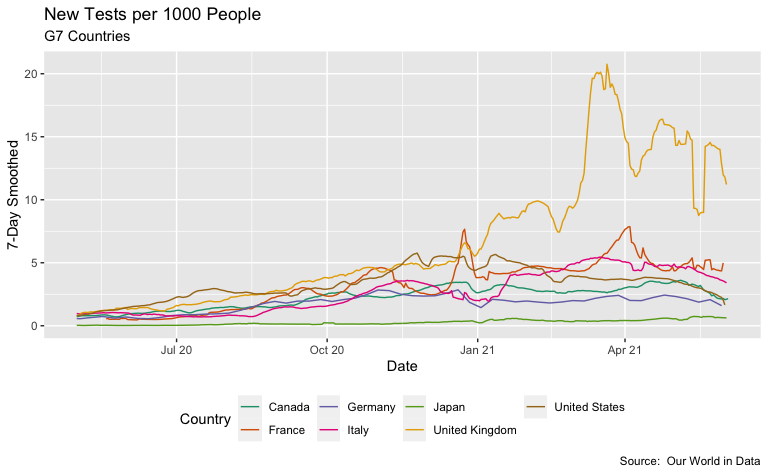
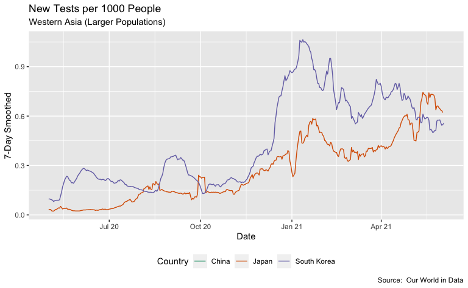
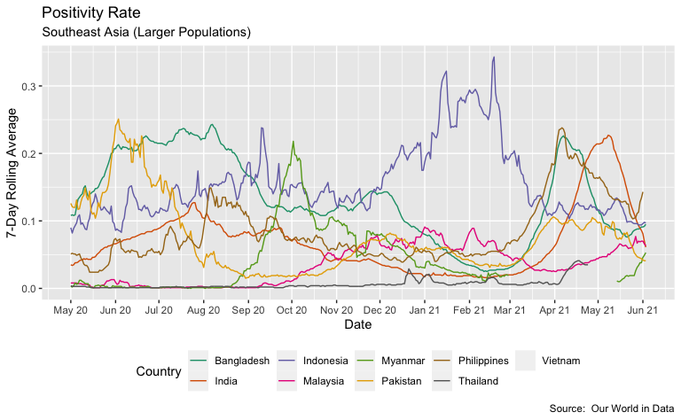
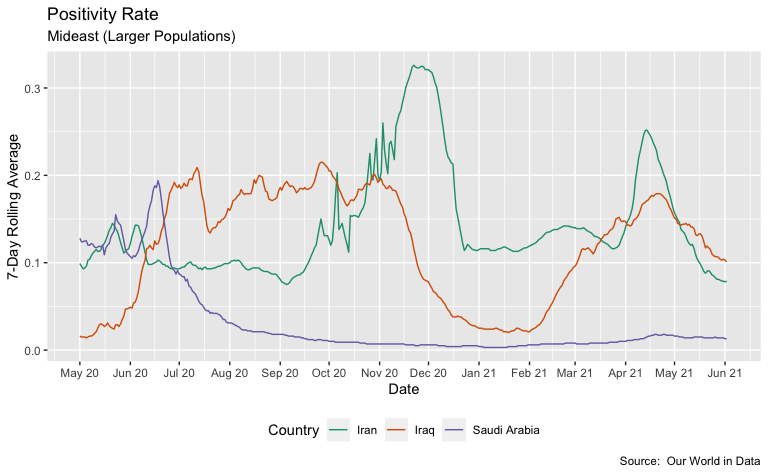

Exploring US COVID-19 Cases and Deaths
================
H. David Shea
2021-04-20

## Our World in Data (OWID) COVID-19 Data

This analysis uses the Our World in Data COVID-19 data sets. These are
available at the [*OWID GitHub
site*](https://covid.ourworldindata.org/).

## Dataset Overview

### Data Sets field descriptions

| column                                    | description                                                                                                                                                                                                                                                                                                                                       |
|:------------------------------------------|:--------------------------------------------------------------------------------------------------------------------------------------------------------------------------------------------------------------------------------------------------------------------------------------------------------------------------------------------------|
| iso\_code                                 | ISO 3166-1 alpha-3 – three-letter country codes                                                                                                                                                                                                                                                                                                   |
| continent                                 | Continent of the geographical location                                                                                                                                                                                                                                                                                                            |
| location                                  | Geographical location                                                                                                                                                                                                                                                                                                                             |
| date                                      | Date of observation                                                                                                                                                                                                                                                                                                                               |
| total\_cases                              | Total confirmed cases of COVID-19                                                                                                                                                                                                                                                                                                                 |
| new\_cases                                | New confirmed cases of COVID-19                                                                                                                                                                                                                                                                                                                   |
| new\_cases\_smoothed                      | New confirmed cases of COVID-19 (7-day smoothed)                                                                                                                                                                                                                                                                                                  |
| total\_deaths                             | Total deaths attributed to COVID-19                                                                                                                                                                                                                                                                                                               |
| new\_deaths                               | New deaths attributed to COVID-19                                                                                                                                                                                                                                                                                                                 |
| new\_deaths\_smoothed                     | New deaths attributed to COVID-19 (7-day smoothed)                                                                                                                                                                                                                                                                                                |
| total\_cases\_per\_million                | Total confirmed cases of COVID-19 per 1,000,000 people                                                                                                                                                                                                                                                                                            |
| new\_cases\_per\_million                  | New confirmed cases of COVID-19 per 1,000,000 people                                                                                                                                                                                                                                                                                              |
| new\_cases\_smoothed\_per\_million        | New confirmed cases of COVID-19 (7-day smoothed) per 1,000,000 people                                                                                                                                                                                                                                                                             |
| total\_deaths\_per\_million               | Total deaths attributed to COVID-19 per 1,000,000 people                                                                                                                                                                                                                                                                                          |
| new\_deaths\_per\_million                 | New deaths attributed to COVID-19 per 1,000,000 people                                                                                                                                                                                                                                                                                            |
| new\_deaths\_smoothed\_per\_million       | New deaths attributed to COVID-19 (7-day smoothed) per 1,000,000 people                                                                                                                                                                                                                                                                           |
| reproduction\_rate                        | Real-time estimate of the effective reproduction rate (R) of COVID-19. See <https://github.com/crondonm/TrackingR/tree/main/Estimates-Database>                                                                                                                                                                                                   |
| icu\_patients                             | Number of COVID-19 patients in intensive care units (ICUs) on a given day                                                                                                                                                                                                                                                                         |
| icu\_patients\_per\_million               | Number of COVID-19 patients in intensive care units (ICUs) on a given day per 1,000,000 people                                                                                                                                                                                                                                                    |
| hosp\_patients                            | Number of COVID-19 patients in hospital on a given day                                                                                                                                                                                                                                                                                            |
| hosp\_patients\_per\_million              | Number of COVID-19 patients in hospital on a given day per 1,000,000 people                                                                                                                                                                                                                                                                       |
| weekly\_icu\_admissions                   | Number of COVID-19 patients newly admitted to intensive care units (ICUs) in a given week                                                                                                                                                                                                                                                         |
| weekly\_icu\_admissions\_per\_million     | Number of COVID-19 patients newly admitted to intensive care units (ICUs) in a given week per 1,000,000 people                                                                                                                                                                                                                                    |
| weekly\_hosp\_admissions                  | Number of COVID-19 patients newly admitted to hospitals in a given week                                                                                                                                                                                                                                                                           |
| weekly\_hosp\_admissions\_per\_million    | Number of COVID-19 patients newly admitted to hospitals in a given week per 1,000,000 people                                                                                                                                                                                                                                                      |
| total\_tests                              | Total tests for COVID-19                                                                                                                                                                                                                                                                                                                          |
| new\_tests                                | New tests for COVID-19 (only calculated for consecutive days)                                                                                                                                                                                                                                                                                     |
| total\_tests\_per\_thousand               | Total tests for COVID-19 per 1,000 people                                                                                                                                                                                                                                                                                                         |
| new\_tests\_per\_thousand                 | New tests for COVID-19 per 1,000 people                                                                                                                                                                                                                                                                                                           |
| new\_tests\_smoothed                      | New tests for COVID-19 (7-day smoothed). For countries that don’t report testing data on a daily basis, we assume that testing changed equally on a daily basis over any periods in which no data was reported. This produces a complete series of daily figures, which is then averaged over a rolling 7-day window                              |
| new\_tests\_smoothed\_per\_thousand       | New tests for COVID-19 (7-day smoothed) per 1,000 people                                                                                                                                                                                                                                                                                          |
| positive\_rate                            | The share of COVID-19 tests that are positive, given as a rolling 7-day average (this is the inverse of tests\_per\_case)                                                                                                                                                                                                                         |
| tests\_per\_case                          | Tests conducted per new confirmed case of COVID-19, given as a rolling 7-day average (this is the inverse of positive\_rate)                                                                                                                                                                                                                      |
| tests\_units                              | Units used by the location to report its testing data                                                                                                                                                                                                                                                                                             |
| total\_vaccinations                       | Total number of COVID-19 vaccination doses administered                                                                                                                                                                                                                                                                                           |
| people\_vaccinated                        | Total number of people who received at least one vaccine dose                                                                                                                                                                                                                                                                                     |
| people\_fully\_vaccinated                 | Total number of people who received all doses prescribed by the vaccination protocol                                                                                                                                                                                                                                                              |
| new\_vaccinations                         | New COVID-19 vaccination doses administered (only calculated for consecutive days)                                                                                                                                                                                                                                                                |
| new\_vaccinations\_smoothed               | New COVID-19 vaccination doses administered (7-day smoothed). For countries that don’t report vaccination data on a daily basis, we assume that vaccination changed equally on a daily basis over any periods in which no data was reported. This produces a complete series of daily figures, which is then averaged over a rolling 7-day window |
| total\_vaccinations\_per\_hundred         | Total number of COVID-19 vaccination doses administered per 100 people in the total population                                                                                                                                                                                                                                                    |
| people\_vaccinated\_per\_hundred          | Total number of people who received at least one vaccine dose per 100 people in the total population                                                                                                                                                                                                                                              |
| people\_fully\_vaccinated\_per\_hundred   | Total number of people who received all doses prescribed by the vaccination protocol per 100 people in the total population                                                                                                                                                                                                                       |
| new\_vaccinations\_smoothed\_per\_million | New COVID-19 vaccination doses administered (7-day smoothed) per 1,000,000 people in the total population                                                                                                                                                                                                                                         |
| stringency\_index                         | Government Response Stringency Index: composite measure based on 9 response indicators including school closures, workplace closures, and travel bans, rescaled to a value from 0 to 100 (100 = strictest response)                                                                                                                               |
| population                                | Population in 2020                                                                                                                                                                                                                                                                                                                                |
| population\_density                       | Number of people divided by land area, measured in square kilometers, most recent year available                                                                                                                                                                                                                                                  |
| median\_age                               | Median age of the population, UN projection for 2020                                                                                                                                                                                                                                                                                              |
| aged\_65\_older                           | Share of the population that is 65 years and older, most recent year available                                                                                                                                                                                                                                                                    |
| aged\_70\_older                           | Share of the population that is 70 years and older in 2015                                                                                                                                                                                                                                                                                        |
| gdp\_per\_capita                          | Gross domestic product at purchasing power parity (constant 2011 international dollars), most recent year available                                                                                                                                                                                                                               |
| extreme\_poverty                          | Share of the population living in extreme poverty, most recent year available since 2010                                                                                                                                                                                                                                                          |
| cardiovasc\_death\_rate                   | Death rate from cardiovascular disease in 2017 (annual number of deaths per 100,000 people)                                                                                                                                                                                                                                                       |
| diabetes\_prevalence                      | Diabetes prevalence (% of population aged 20 to 79) in 2017                                                                                                                                                                                                                                                                                       |
| female\_smokers                           | Share of women who smoke, most recent year available                                                                                                                                                                                                                                                                                              |
| male\_smokers                             | Share of men who smoke, most recent year available                                                                                                                                                                                                                                                                                                |
| handwashing\_facilities                   | Share of the population with basic handwashing facilities on premises, most recent year available                                                                                                                                                                                                                                                 |
| hospital\_beds\_per\_thousand             | Hospital beds per 1,000 people, most recent year available since 2010                                                                                                                                                                                                                                                                             |
| life\_expectancy                          | Life expectancy at birth in 2019                                                                                                                                                                                                                                                                                                                  |
| human\_development\_index                 | A composite index measuring average achievement in three basic dimensions of human development—a long and healthy life, knowledge and a decent standard of living. Values for 2019, imported from <http://hdr.undp.org/en/indicators/137506>                                                                                                      |

## Example Data

| iso\_code | continent     | location      | date       | total\_cases | new\_cases | new\_cases\_smoothed | total\_deaths | new\_deaths | new\_deaths\_smoothed | total\_cases\_per\_million | new\_cases\_per\_million | new\_cases\_smoothed\_per\_million | total\_deaths\_per\_million | new\_deaths\_per\_million | new\_deaths\_smoothed\_per\_million | reproduction\_rate | icu\_patients | icu\_patients\_per\_million | hosp\_patients | hosp\_patients\_per\_million | weekly\_icu\_admissions | weekly\_icu\_admissions\_per\_million | weekly\_hosp\_admissions | weekly\_hosp\_admissions\_per\_million | new\_tests | total\_tests | total\_tests\_per\_thousand | new\_tests\_per\_thousand | new\_tests\_smoothed | new\_tests\_smoothed\_per\_thousand | positive\_rate | tests\_per\_case | tests\_units    | total\_vaccinations | people\_vaccinated | people\_fully\_vaccinated | new\_vaccinations | new\_vaccinations\_smoothed | total\_vaccinations\_per\_hundred | people\_vaccinated\_per\_hundred | people\_fully\_vaccinated\_per\_hundred | new\_vaccinations\_smoothed\_per\_million | stringency\_index | population | population\_density | median\_age | aged\_65\_older | aged\_70\_older | gdp\_per\_capita | extreme\_poverty | cardiovasc\_death\_rate | diabetes\_prevalence | female\_smokers | male\_smokers | handwashing\_facilities | hospital\_beds\_per\_thousand | life\_expectancy | human\_development\_index |
|:----------|:--------------|:--------------|:-----------|-------------:|-----------:|---------------------:|--------------:|------------:|----------------------:|---------------------------:|-------------------------:|-----------------------------------:|----------------------------:|--------------------------:|------------------------------------:|-------------------:|--------------:|----------------------------:|---------------:|-----------------------------:|------------------------:|--------------------------------------:|-------------------------:|---------------------------------------:|-----------:|-------------:|----------------------------:|--------------------------:|---------------------:|------------------------------------:|---------------:|-----------------:|:----------------|--------------------:|-------------------:|--------------------------:|------------------:|----------------------------:|----------------------------------:|---------------------------------:|----------------------------------------:|------------------------------------------:|------------------:|-----------:|--------------------:|------------:|----------------:|----------------:|-----------------:|-----------------:|------------------------:|---------------------:|----------------:|--------------:|------------------------:|------------------------------:|-----------------:|--------------------------:|
| JPN       | Asia          | Japan         | 2020-02-03 |           20 |          0 |                2.286 |            NA |          NA |                     0 |                      0.158 |                    0.000 |                              0.018 |                          NA |                        NA |                                   0 |                 NA |            NA |                          NA |             NA |                           NA |                      NA |                                    NA |                       NA |                                     NA |         NA |           NA |                          NA |                        NA |                   NA |                                  NA |             NA |               NA |                 |                  NA |                 NA |                        NA |                NA |                          NA |                                NA |                               NA |                                      NA |                                        NA |              8.33 |  126476458 |             347.778 |        48.2 |          27.049 |          18.493 |        39002.223 |               NA |                  79.370 |                 5.72 |            11.2 |          33.7 |                      NA |                         13.05 |            84.63 |                     0.919 |
| MYS       | Asia          | Malaysia      | 2020-02-03 |            8 |          0 |                0.571 |            NA |          NA |                     0 |                      0.247 |                    0.000 |                              0.018 |                          NA |                        NA |                                   0 |                 NA |            NA |                          NA |             NA |                           NA |                      NA |                                    NA |                       NA |                                     NA |         NA |           NA |                          NA |                        NA |                   NA |                                  NA |             NA |               NA |                 |                  NA |                 NA |                        NA |                NA |                          NA |                                NA |                               NA |                                      NA |                                        NA |             19.44 |   32365998 |              96.254 |        29.9 |           6.293 |           3.407 |        26808.164 |              0.1 |                 260.942 |                16.74 |             1.0 |          42.4 |                      NA |                          1.90 |            76.16 |                     0.810 |
| MEX       | North America | Mexico        | 2020-02-03 |           NA |         NA |                   NA |            NA |          NA |                    NA |                         NA |                       NA |                                 NA |                          NA |                        NA |                                  NA |                 NA |            NA |                          NA |             NA |                           NA |                      NA |                                    NA |                       NA |                                     NA |        147 |         5809 |                       0.045 |                     0.001 |                  166 |                               0.001 |          0.015 |             66.7 | people tested   |                  NA |                 NA |                        NA |                NA |                          NA |                                NA |                               NA |                                      NA |                                        NA |              0.00 |  128932753 |              66.444 |        29.3 |           6.857 |           4.321 |        17336.469 |              2.5 |                 152.783 |                13.06 |             6.9 |          21.4 |                  87.847 |                          1.38 |            75.05 |                     0.779 |
| NPL       | Asia          | Nepal         | 2020-02-03 |            1 |          0 |                0.000 |            NA |          NA |                     0 |                      0.034 |                    0.000 |                              0.000 |                          NA |                        NA |                                   0 |                 NA |            NA |                          NA |             NA |                           NA |                      NA |                                    NA |                       NA |                                     NA |         NA |           NA |                          NA |                        NA |                   NA |                                  NA |             NA |               NA | tests performed |                  NA |                 NA |                        NA |                NA |                          NA |                                NA |                               NA |                                      NA |                                        NA |             13.89 |   29136808 |             204.430 |        25.0 |           5.809 |           3.212 |         2442.804 |             15.0 |                 260.797 |                 7.26 |             9.5 |          37.8 |                  47.782 |                          0.30 |            70.78 |                     0.602 |
| OWID\_NAM |               | North America | 2020-02-03 |           15 |          3 |                1.286 |            NA |           0 |                     0 |                      0.025 |                    0.005 |                              0.002 |                          NA |                         0 |                                   0 |                 NA |            NA |                          NA |             NA |                           NA |                      NA |                                    NA |                       NA |                                     NA |         NA |           NA |                          NA |                        NA |                   NA |                                  NA |             NA |               NA |                 |                  NA |                 NA |                        NA |                NA |                          NA |                                NA |                               NA |                                      NA |                                        NA |                NA |  592072204 |                  NA |          NA |              NA |              NA |               NA |               NA |                      NA |                   NA |              NA |            NA |                      NA |                            NA |               NA |                        NA |
| OWID\_OCE |               | Oceania       | 2020-02-03 |           12 |          0 |                1.000 |            NA |           0 |                     0 |                      0.281 |                    0.000 |                              0.023 |                          NA |                         0 |                                   0 |                 NA |            NA |                          NA |             NA |                           NA |                      NA |                                    NA |                       NA |                                     NA |         NA |           NA |                          NA |                        NA |                   NA |                                  NA |             NA |               NA |                 |                  NA |                 NA |                        NA |                NA |                          NA |                                NA |                               NA |                                      NA |                                        NA |                NA |   42677809 |                  NA |          NA |              NA |              NA |               NA |               NA |                      NA |                   NA |              NA |            NA |                      NA |                            NA |               NA |                        NA |
| PER       | South America | Peru          | 2020-02-03 |           NA |         NA |                   NA |            NA |          NA |                    NA |                         NA |                       NA |                                 NA |                          NA |                        NA |                                  NA |                 NA |            NA |                          NA |             NA |                           NA |                      NA |                                    NA |                       NA |                                     NA |          3 |           27 |                       0.001 |                     0.000 |                    2 |                               0.000 |          0.053 |             18.9 | tests performed |                  NA |                 NA |                        NA |                NA |                          NA |                                NA |                               NA |                                      NA |                                        NA |              0.00 |   32971846 |              25.129 |        29.1 |           7.151 |           4.455 |        12236.706 |              3.5 |                  85.755 |                 5.95 |             4.8 |            NA |                      NA |                          1.60 |            76.74 |                     0.777 |
| PHL       | Asia          | Philippines   | 2020-02-03 |            2 |          0 |                   NA |             1 |           0 |                    NA |                      0.018 |                    0.000 |                                 NA |                       0.009 |                         0 |                                  NA |                 NA |            NA |                          NA |             NA |                           NA |                      NA |                                    NA |                       NA |                                     NA |         NA |           NA |                          NA |                        NA |                   NA |                                  NA |             NA |               NA |                 |                  NA |                 NA |                        NA |                NA |                          NA |                                NA |                               NA |                                      NA |                                        NA |             19.44 |  109581085 |             351.873 |        25.2 |           4.803 |           2.661 |         7599.188 |               NA |                 370.437 |                 7.07 |             7.8 |          40.8 |                  78.463 |                          1.00 |            71.23 |                     0.718 |
| RUS       | Europe        | Russia        | 2020-02-03 |            2 |          0 |                   NA |            NA |          NA |                    NA |                      0.014 |                    0.000 |                                 NA |                          NA |                        NA |                                  NA |                 NA |            NA |                          NA |             NA |                           NA |                      NA |                                    NA |                       NA |                                     NA |         NA |           NA |                          NA |                        NA |                   NA |                                  NA |             NA |               NA |                 |                  NA |                 NA |                        NA |                NA |                          NA |                                NA |                               NA |                                      NA |                                        NA |              8.33 |  145934460 |               8.823 |        39.6 |          14.178 |           9.393 |        24765.954 |              0.1 |                 431.297 |                 6.18 |            23.4 |          58.3 |                      NA |                          8.05 |            72.58 |                     0.824 |
| SGP       | Asia          | Singapore     | 2020-02-03 |           18 |          0 |                1.857 |            NA |          NA |                     0 |                      3.077 |                    0.000 |                              0.317 |                          NA |                        NA |                                   0 |                 NA |            NA |                          NA |             NA |                           NA |                      NA |                                    NA |                       NA |                                     NA |         NA |           NA |                          NA |                        NA |                   NA |                                  NA |             NA |               NA |                 |                  NA |                 NA |                        NA |                NA |                          NA |                                NA |                               NA |                                      NA |                                        NA |             25.00 |    5850343 |            7915.731 |        42.4 |          12.922 |           7.049 |        85535.383 |               NA |                  92.243 |                10.99 |             5.2 |          28.3 |                      NA |                          2.40 |            83.62 |                     0.938 |

## Exploratory Data Analyses

### World Cases versus Deaths

### US Cases versus Deaths

### Global Regions

### Current Problem Areas

#### Countries with Highest Change in Cases Over the Past Month

| location    | date       | cases\_change |
|:------------|:-----------|--------------:|
| Yemen       | 2021-04-19 |          1.79 |
| Thailand    | 2021-04-19 |          1.58 |
| Philippines | 2021-04-19 |          1.44 |
| Turkey      | 2021-04-19 |          1.44 |
| India       | 2021-04-19 |          1.32 |
| Poland      | 2021-04-19 |          1.32 |

#### Countries with Highest Change in Deaths Over the Past Month

| location  | date       | deaths\_change |
|:----------|:-----------|---------------:|
| Yemen     | 2021-04-19 |       1.535957 |
| Ukraine   | 2021-04-19 |       1.332153 |
| Venezuela | 2021-04-19 |       1.298045 |
| Ethiopia  | 2021-04-19 |       1.281451 |
| Brazil    | 2021-04-19 |       1.279861 |
| Poland    | 2021-04-19 |       1.263919 |

### Testing

#### Tests per 100 People

#### Positivity Rates

