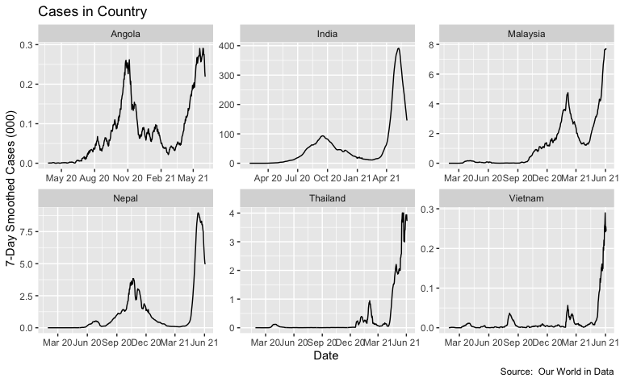
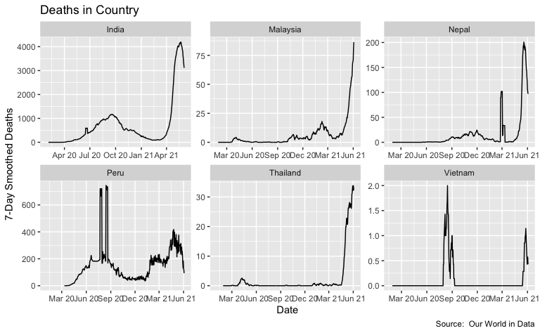
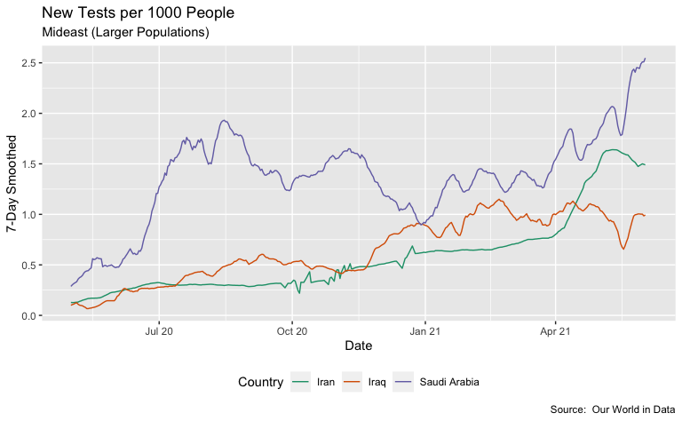
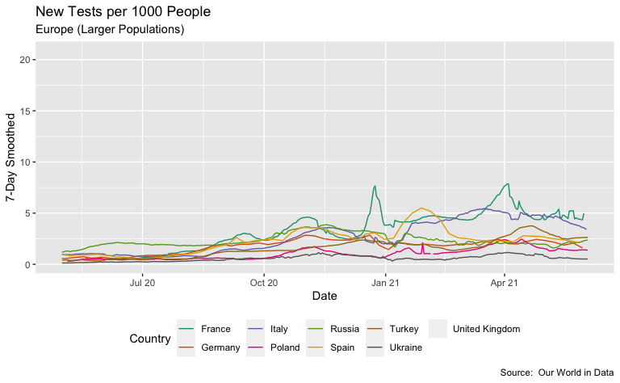
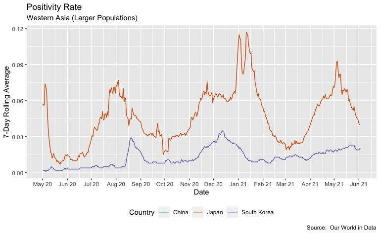
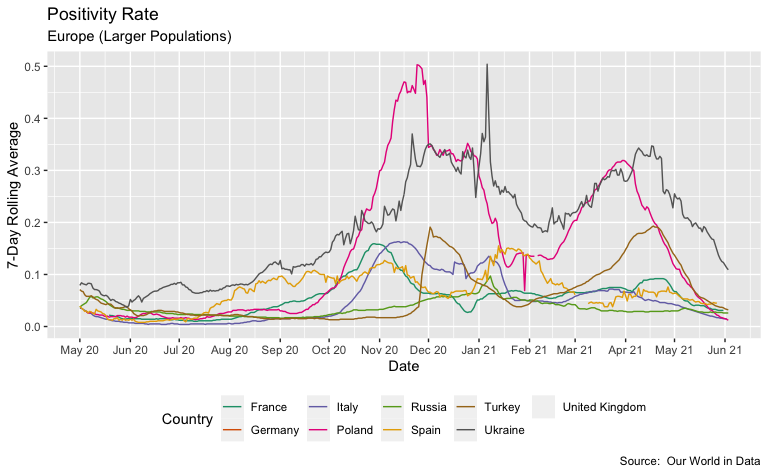

Exploring US COVID-19 Cases and Deaths
================
H. David Shea
2021-04-20

## Our World in Data (OWID) COVID-19 Data

This analysis uses the Our World in Data COVID-19 data sets. These are
available at the [*OWID GitHub
site*](https://covid.ourworldindata.org/).

## Dataset Overview

### Data Sets field descriptions

| column                                    | description                                                                                                                                                                                                                                                                                                                                       |
|:------------------------------------------|:--------------------------------------------------------------------------------------------------------------------------------------------------------------------------------------------------------------------------------------------------------------------------------------------------------------------------------------------------|
| iso\_code                                 | ISO 3166-1 alpha-3 – three-letter country codes                                                                                                                                                                                                                                                                                                   |
| continent                                 | Continent of the geographical location                                                                                                                                                                                                                                                                                                            |
| location                                  | Geographical location                                                                                                                                                                                                                                                                                                                             |
| date                                      | Date of observation                                                                                                                                                                                                                                                                                                                               |
| total\_cases                              | Total confirmed cases of COVID-19                                                                                                                                                                                                                                                                                                                 |
| new\_cases                                | New confirmed cases of COVID-19                                                                                                                                                                                                                                                                                                                   |
| new\_cases\_smoothed                      | New confirmed cases of COVID-19 (7-day smoothed)                                                                                                                                                                                                                                                                                                  |
| total\_deaths                             | Total deaths attributed to COVID-19                                                                                                                                                                                                                                                                                                               |
| new\_deaths                               | New deaths attributed to COVID-19                                                                                                                                                                                                                                                                                                                 |
| new\_deaths\_smoothed                     | New deaths attributed to COVID-19 (7-day smoothed)                                                                                                                                                                                                                                                                                                |
| total\_cases\_per\_million                | Total confirmed cases of COVID-19 per 1,000,000 people                                                                                                                                                                                                                                                                                            |
| new\_cases\_per\_million                  | New confirmed cases of COVID-19 per 1,000,000 people                                                                                                                                                                                                                                                                                              |
| new\_cases\_smoothed\_per\_million        | New confirmed cases of COVID-19 (7-day smoothed) per 1,000,000 people                                                                                                                                                                                                                                                                             |
| total\_deaths\_per\_million               | Total deaths attributed to COVID-19 per 1,000,000 people                                                                                                                                                                                                                                                                                          |
| new\_deaths\_per\_million                 | New deaths attributed to COVID-19 per 1,000,000 people                                                                                                                                                                                                                                                                                            |
| new\_deaths\_smoothed\_per\_million       | New deaths attributed to COVID-19 (7-day smoothed) per 1,000,000 people                                                                                                                                                                                                                                                                           |
| reproduction\_rate                        | Real-time estimate of the effective reproduction rate (R) of COVID-19. See <https://github.com/crondonm/TrackingR/tree/main/Estimates-Database>                                                                                                                                                                                                   |
| icu\_patients                             | Number of COVID-19 patients in intensive care units (ICUs) on a given day                                                                                                                                                                                                                                                                         |
| icu\_patients\_per\_million               | Number of COVID-19 patients in intensive care units (ICUs) on a given day per 1,000,000 people                                                                                                                                                                                                                                                    |
| hosp\_patients                            | Number of COVID-19 patients in hospital on a given day                                                                                                                                                                                                                                                                                            |
| hosp\_patients\_per\_million              | Number of COVID-19 patients in hospital on a given day per 1,000,000 people                                                                                                                                                                                                                                                                       |
| weekly\_icu\_admissions                   | Number of COVID-19 patients newly admitted to intensive care units (ICUs) in a given week                                                                                                                                                                                                                                                         |
| weekly\_icu\_admissions\_per\_million     | Number of COVID-19 patients newly admitted to intensive care units (ICUs) in a given week per 1,000,000 people                                                                                                                                                                                                                                    |
| weekly\_hosp\_admissions                  | Number of COVID-19 patients newly admitted to hospitals in a given week                                                                                                                                                                                                                                                                           |
| weekly\_hosp\_admissions\_per\_million    | Number of COVID-19 patients newly admitted to hospitals in a given week per 1,000,000 people                                                                                                                                                                                                                                                      |
| total\_tests                              | Total tests for COVID-19                                                                                                                                                                                                                                                                                                                          |
| new\_tests                                | New tests for COVID-19 (only calculated for consecutive days)                                                                                                                                                                                                                                                                                     |
| total\_tests\_per\_thousand               | Total tests for COVID-19 per 1,000 people                                                                                                                                                                                                                                                                                                         |
| new\_tests\_per\_thousand                 | New tests for COVID-19 per 1,000 people                                                                                                                                                                                                                                                                                                           |
| new\_tests\_smoothed                      | New tests for COVID-19 (7-day smoothed). For countries that don’t report testing data on a daily basis, we assume that testing changed equally on a daily basis over any periods in which no data was reported. This produces a complete series of daily figures, which is then averaged over a rolling 7-day window                              |
| new\_tests\_smoothed\_per\_thousand       | New tests for COVID-19 (7-day smoothed) per 1,000 people                                                                                                                                                                                                                                                                                          |
| positive\_rate                            | The share of COVID-19 tests that are positive, given as a rolling 7-day average (this is the inverse of tests\_per\_case)                                                                                                                                                                                                                         |
| tests\_per\_case                          | Tests conducted per new confirmed case of COVID-19, given as a rolling 7-day average (this is the inverse of positive\_rate)                                                                                                                                                                                                                      |
| tests\_units                              | Units used by the location to report its testing data                                                                                                                                                                                                                                                                                             |
| total\_vaccinations                       | Total number of COVID-19 vaccination doses administered                                                                                                                                                                                                                                                                                           |
| people\_vaccinated                        | Total number of people who received at least one vaccine dose                                                                                                                                                                                                                                                                                     |
| people\_fully\_vaccinated                 | Total number of people who received all doses prescribed by the vaccination protocol                                                                                                                                                                                                                                                              |
| new\_vaccinations                         | New COVID-19 vaccination doses administered (only calculated for consecutive days)                                                                                                                                                                                                                                                                |
| new\_vaccinations\_smoothed               | New COVID-19 vaccination doses administered (7-day smoothed). For countries that don’t report vaccination data on a daily basis, we assume that vaccination changed equally on a daily basis over any periods in which no data was reported. This produces a complete series of daily figures, which is then averaged over a rolling 7-day window |
| total\_vaccinations\_per\_hundred         | Total number of COVID-19 vaccination doses administered per 100 people in the total population                                                                                                                                                                                                                                                    |
| people\_vaccinated\_per\_hundred          | Total number of people who received at least one vaccine dose per 100 people in the total population                                                                                                                                                                                                                                              |
| people\_fully\_vaccinated\_per\_hundred   | Total number of people who received all doses prescribed by the vaccination protocol per 100 people in the total population                                                                                                                                                                                                                       |
| new\_vaccinations\_smoothed\_per\_million | New COVID-19 vaccination doses administered (7-day smoothed) per 1,000,000 people in the total population                                                                                                                                                                                                                                         |
| stringency\_index                         | Government Response Stringency Index: composite measure based on 9 response indicators including school closures, workplace closures, and travel bans, rescaled to a value from 0 to 100 (100 = strictest response)                                                                                                                               |
| population                                | Population in 2020                                                                                                                                                                                                                                                                                                                                |
| population\_density                       | Number of people divided by land area, measured in square kilometers, most recent year available                                                                                                                                                                                                                                                  |
| median\_age                               | Median age of the population, UN projection for 2020                                                                                                                                                                                                                                                                                              |
| aged\_65\_older                           | Share of the population that is 65 years and older, most recent year available                                                                                                                                                                                                                                                                    |
| aged\_70\_older                           | Share of the population that is 70 years and older in 2015                                                                                                                                                                                                                                                                                        |
| gdp\_per\_capita                          | Gross domestic product at purchasing power parity (constant 2011 international dollars), most recent year available                                                                                                                                                                                                                               |
| extreme\_poverty                          | Share of the population living in extreme poverty, most recent year available since 2010                                                                                                                                                                                                                                                          |
| cardiovasc\_death\_rate                   | Death rate from cardiovascular disease in 2017 (annual number of deaths per 100,000 people)                                                                                                                                                                                                                                                       |
| diabetes\_prevalence                      | Diabetes prevalence (% of population aged 20 to 79) in 2017                                                                                                                                                                                                                                                                                       |
| female\_smokers                           | Share of women who smoke, most recent year available                                                                                                                                                                                                                                                                                              |
| male\_smokers                             | Share of men who smoke, most recent year available                                                                                                                                                                                                                                                                                                |
| handwashing\_facilities                   | Share of the population with basic handwashing facilities on premises, most recent year available                                                                                                                                                                                                                                                 |
| hospital\_beds\_per\_thousand             | Hospital beds per 1,000 people, most recent year available since 2010                                                                                                                                                                                                                                                                             |
| life\_expectancy                          | Life expectancy at birth in 2019                                                                                                                                                                                                                                                                                                                  |
| human\_development\_index                 | A composite index measuring average achievement in three basic dimensions of human development—a long and healthy life, knowledge and a decent standard of living. Values for 2019, imported from <http://hdr.undp.org/en/indicators/137506>                                                                                                      |

## Example Data

| iso\_code | continent     | location             | date       | total\_cases | new\_cases | new\_cases\_smoothed | total\_deaths | new\_deaths | new\_deaths\_smoothed | total\_cases\_per\_million | new\_cases\_per\_million | new\_cases\_smoothed\_per\_million | total\_deaths\_per\_million | new\_deaths\_per\_million | new\_deaths\_smoothed\_per\_million | reproduction\_rate | icu\_patients | icu\_patients\_per\_million | hosp\_patients | hosp\_patients\_per\_million | weekly\_icu\_admissions | weekly\_icu\_admissions\_per\_million | weekly\_hosp\_admissions | weekly\_hosp\_admissions\_per\_million | new\_tests | total\_tests | total\_tests\_per\_thousand | new\_tests\_per\_thousand | new\_tests\_smoothed | new\_tests\_smoothed\_per\_thousand | positive\_rate | tests\_per\_case | tests\_units    | total\_vaccinations | people\_vaccinated | people\_fully\_vaccinated | new\_vaccinations | new\_vaccinations\_smoothed | total\_vaccinations\_per\_hundred | people\_vaccinated\_per\_hundred | people\_fully\_vaccinated\_per\_hundred | new\_vaccinations\_smoothed\_per\_million | stringency\_index | population | population\_density | median\_age | aged\_65\_older | aged\_70\_older | gdp\_per\_capita | extreme\_poverty | cardiovasc\_death\_rate | diabetes\_prevalence | female\_smokers | male\_smokers | handwashing\_facilities | hospital\_beds\_per\_thousand | life\_expectancy | human\_development\_index |
|:----------|:--------------|:---------------------|:-----------|-------------:|-----------:|---------------------:|--------------:|------------:|----------------------:|---------------------------:|-------------------------:|-----------------------------------:|----------------------------:|--------------------------:|------------------------------------:|-------------------:|--------------:|----------------------------:|---------------:|-----------------------------:|------------------------:|--------------------------------------:|-------------------------:|---------------------------------------:|-----------:|-------------:|----------------------------:|--------------------------:|---------------------:|------------------------------------:|---------------:|-----------------:|:----------------|--------------------:|-------------------:|--------------------------:|------------------:|----------------------------:|----------------------------------:|---------------------------------:|----------------------------------------:|------------------------------------------:|------------------:|-----------:|--------------------:|------------:|----------------:|----------------:|-----------------:|-----------------:|------------------------:|---------------------:|----------------:|--------------:|------------------------:|------------------------------:|-----------------:|--------------------------:|
| KOR       | Asia          | South Korea          | 2020-02-02 |           15 |          3 |                1.714 |            NA |          NA |                     0 |                      0.293 |                    0.059 |                              0.033 |                          NA |                        NA |                                   0 |                 NA |            NA |                          NA |             NA |                           NA |                      NA |                                    NA |                       NA |                                     NA |         58 |          429 |                       0.008 |                     0.001 |                   54 |                               0.001 |          0.032 |             31.5 | people tested   |                  NA |                 NA |                        NA |                NA |                          NA |                                NA |                               NA |                                      NA |                                        NA |             13.89 |   51269183 |             527.967 |        43.4 |          13.914 |           8.622 |        35938.374 |              0.2 |                  85.998 |                 6.80 |             6.2 |          40.9 |                      NA |                         12.27 |            83.03 |                     0.916 |
| ESP       | Europe        | Spain                | 2020-02-02 |            1 |          0 |                   NA |            NA |          NA |                    NA |                      0.021 |                    0.000 |                                 NA |                          NA |                        NA |                                  NA |                 NA |            NA |                          NA |             NA |                           NA |                   2.963 |                                 0.063 |                    17.78 |                                   0.38 |         NA |           NA |                          NA |                        NA |                   NA |                                  NA |             NA |               NA |                 |                  NA |                 NA |                        NA |                NA |                          NA |                                NA |                               NA |                                      NA |                                        NA |             11.11 |   46754783 |              93.105 |        45.5 |          19.436 |          13.799 |        34272.360 |              1.0 |                  99.403 |                 7.17 |            27.4 |          31.4 |                      NA |                          2.97 |            83.56 |                     0.904 |
| LKA       | Asia          | Sri Lanka            | 2020-02-02 |            1 |          0 |                0.143 |            NA |          NA |                     0 |                      0.047 |                    0.000 |                              0.007 |                          NA |                        NA |                                   0 |                 NA |            NA |                          NA |             NA |                           NA |                      NA |                                    NA |                       NA |                                     NA |         NA |           NA |                          NA |                        NA |                   NA |                                  NA |             NA |               NA |                 |                  NA |                 NA |                        NA |                NA |                          NA |                                NA |                               NA |                                      NA |                                        NA |              8.33 |   21413250 |             341.955 |        34.1 |          10.069 |           5.331 |        11669.077 |              0.7 |                 197.093 |                10.68 |             0.3 |          27.0 |                      NA |                          3.60 |            76.98 |                     0.782 |
| SWE       | Europe        | Sweden               | 2020-02-02 |            1 |          0 |                   NA |            NA |          NA |                    NA |                      0.099 |                    0.000 |                                 NA |                          NA |                        NA |                                  NA |                 NA |            NA |                          NA |             NA |                           NA |                      NA |                                    NA |                       NA |                                     NA |         NA |           NA |                          NA |                        NA |                   NA |                                  NA |             NA |               NA |                 |                  NA |                 NA |                        NA |                NA |                          NA |                                NA |                               NA |                                      NA |                                        NA |              0.00 |   10099270 |              24.718 |        41.0 |          19.985 |          13.433 |        46949.283 |              0.5 |                 133.982 |                 4.79 |            18.8 |          18.9 |                      NA |                          2.22 |            82.80 |                     0.945 |
| TWN       | Asia          | Taiwan               | 2020-02-02 |           10 |          0 |                0.857 |            NA |          NA |                     0 |                      0.420 |                    0.000 |                              0.036 |                          NA |                        NA |                                   0 |                 NA |            NA |                          NA |             NA |                           NA |                      NA |                                    NA |                       NA |                                     NA |         64 |         1067 |                       0.045 |                     0.003 |                   95 |                               0.004 |          0.009 |            110.9 | people tested   |                  NA |                 NA |                        NA |                NA |                          NA |                                NA |                               NA |                                      NA |                                        NA |             30.56 |   23816775 |                  NA |        42.2 |              NA |           8.353 |               NA |               NA |                 103.957 |                   NA |              NA |            NA |                      NA |                            NA |            80.46 |                        NA |
| THA       | Asia          | Thailand             | 2020-02-02 |           19 |          0 |                1.571 |            NA |          NA |                     0 |                      0.272 |                    0.000 |                              0.023 |                          NA |                        NA |                                   0 |                 NA |            NA |                          NA |             NA |                           NA |                      NA |                                    NA |                       NA |                                     NA |        153 |         1223 |                       0.018 |                     0.002 |                  128 |                               0.002 |          0.066 |             15.2 | tests performed |                  NA |                 NA |                        NA |                NA |                          NA |                                NA |                               NA |                                      NA |                                        NA |              0.00 |   69799978 |             135.132 |        40.1 |          11.373 |           6.890 |        16277.671 |              0.1 |                 109.861 |                 7.04 |             1.9 |          38.8 |                  90.670 |                          2.10 |            77.15 |                     0.777 |
| ARE       | Asia          | United Arab Emirates | 2020-02-02 |            5 |          1 |                   NA |            NA |          NA |                    NA |                      0.506 |                    0.101 |                                 NA |                          NA |                        NA |                                  NA |                 NA |            NA |                          NA |             NA |                           NA |                      NA |                                    NA |                       NA |                                     NA |         NA |           NA |                          NA |                        NA |                   NA |                                  NA |             NA |               NA | tests performed |                  NA |                 NA |                        NA |                NA |                          NA |                                NA |                               NA |                                      NA |                                        NA |              2.78 |    9890400 |             112.442 |        34.0 |           1.144 |           0.526 |        67293.483 |               NA |                 317.840 |                17.26 |             1.2 |          37.4 |                      NA |                          1.20 |            77.97 |                     0.890 |
| GBR       | Europe        | United Kingdom       | 2020-02-02 |            2 |          0 |                   NA |            NA |          NA |                    NA |                      0.029 |                    0.000 |                                 NA |                          NA |                        NA |                                  NA |                 NA |            NA |                          NA |             NA |                           NA |                      NA |                                    NA |                       NA |                                     NA |         NA |           NA |                          NA |                        NA |                   NA |                                  NA |             NA |               NA |                 |                  NA |                 NA |                        NA |                NA |                          NA |                                NA |                               NA |                                      NA |                                        NA |             11.11 |   67886004 |             272.898 |        40.8 |          18.517 |          12.527 |        39753.244 |              0.2 |                 122.137 |                 4.28 |            20.0 |          24.7 |                      NA |                          2.54 |            81.32 |                     0.932 |
| USA       | North America | United States        | 2020-02-02 |            8 |          0 |                0.429 |            NA |          NA |                     0 |                      0.024 |                    0.000 |                              0.001 |                          NA |                        NA |                                   0 |                 NA |            NA |                          NA |             NA |                           NA |                      NA |                                    NA |                       NA |                                     NA |         NA |           NA |                          NA |                        NA |                   NA |                                  NA |             NA |               NA |                 |                  NA |                 NA |                        NA |                NA |                          NA |                                NA |                               NA |                                      NA |                                        NA |              5.56 |  331002647 |              35.608 |        38.3 |          15.413 |           9.732 |        54225.446 |              1.2 |                 151.089 |                10.79 |            19.1 |          24.6 |                      NA |                          2.77 |            78.86 |                     0.926 |
| VNM       | Asia          | Vietnam              | 2020-02-02 |            6 |          0 |                0.571 |            NA |          NA |                     0 |                      0.062 |                    0.000 |                              0.006 |                          NA |                        NA |                                   0 |                 NA |            NA |                          NA |             NA |                           NA |                      NA |                                    NA |                       NA |                                     NA |         NA |           NA |                          NA |                        NA |                   NA |                                  NA |             NA |               NA |                 |                  NA |                 NA |                        NA |                NA |                          NA |                                NA |                               NA |                                      NA |                                        NA |             28.70 |   97338583 |             308.127 |        32.6 |           7.150 |           4.718 |         6171.884 |              2.0 |                 245.465 |                 6.00 |             1.0 |          45.9 |                  85.847 |                          2.60 |            75.40 |                     0.704 |

## Exploratory Data Analyses

### World Cases versus Deaths

### US Cases versus Deaths

### Global Regions

### Current Problem Areas

#### Countries with Highest Change in Cases Over the Past Month

| location | date       | cases\_change |
|:---------|:-----------|--------------:|
| Vietnam  | 2021-06-02 |          2.64 |
| Thailand | 2021-06-02 |          2.33 |
| Nepal    | 2021-06-02 |          1.66 |
| Malaysia | 2021-06-02 |          1.41 |
| India    | 2021-06-02 |          1.40 |
| Angola   | 2021-06-02 |          1.29 |

#### Countries with Highest Change in Deaths Over the Past Month

| location | date       | deaths\_change |
|:---------|:-----------|---------------:|
| Thailand | 2021-06-02 |       4.010870 |
| Peru     | 2021-06-02 |       2.965002 |
| Nepal    | 2021-06-02 |       2.247174 |
| Malaysia | 2021-06-02 |       1.929723 |
| India    | 2021-06-02 |       1.519680 |
| Vietnam  | 2021-06-02 |       1.400000 |

### Testing

#### Tests per 1000 People

#### Positivity Rates

