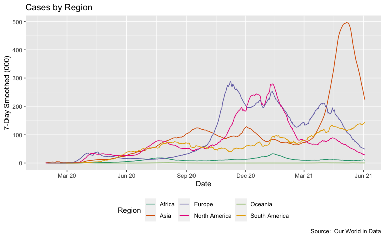
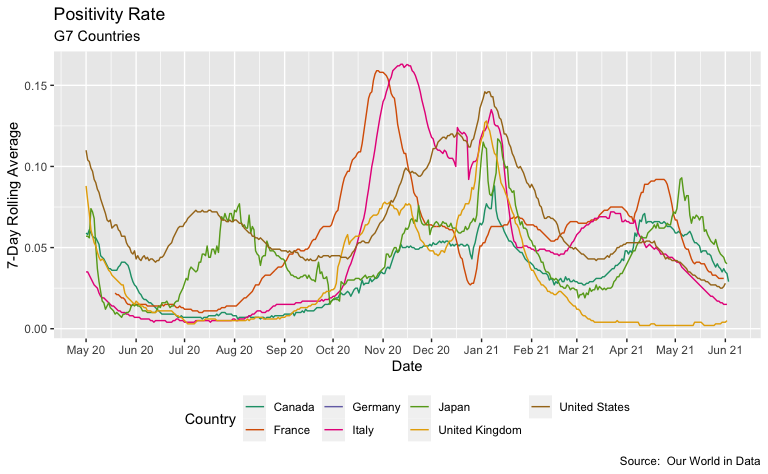
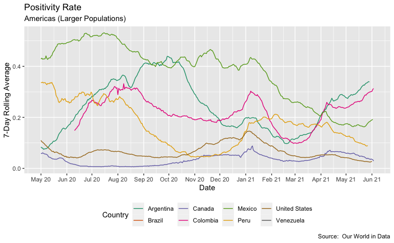
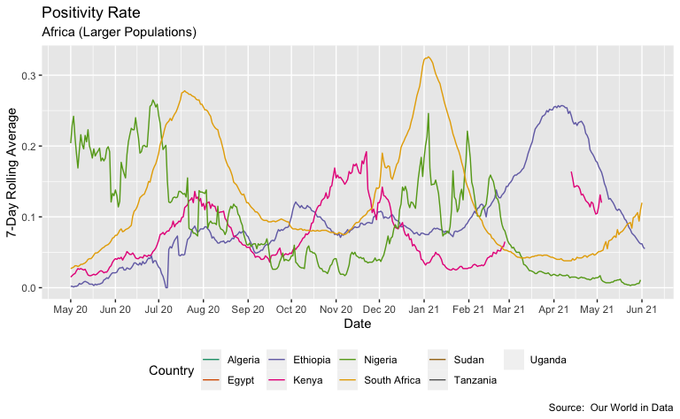

Exploring US COVID-19 Cases and Deaths
================
H. David Shea
2021-04-20

## Our World in Data (OWID) COVID-19 Data

This analysis uses the Our World in Data COVID-19 data sets. These are
available at the [*OWID GitHub
site*](https://covid.ourworldindata.org/).

## Dataset Overview

### Data Sets field descriptions

| column                                    | description                                                                                                                                                                                                                                                                                                                                       |
|:------------------------------------------|:--------------------------------------------------------------------------------------------------------------------------------------------------------------------------------------------------------------------------------------------------------------------------------------------------------------------------------------------------|
| iso\_code                                 | ISO 3166-1 alpha-3 – three-letter country codes                                                                                                                                                                                                                                                                                                   |
| continent                                 | Continent of the geographical location                                                                                                                                                                                                                                                                                                            |
| location                                  | Geographical location                                                                                                                                                                                                                                                                                                                             |
| date                                      | Date of observation                                                                                                                                                                                                                                                                                                                               |
| total\_cases                              | Total confirmed cases of COVID-19                                                                                                                                                                                                                                                                                                                 |
| new\_cases                                | New confirmed cases of COVID-19                                                                                                                                                                                                                                                                                                                   |
| new\_cases\_smoothed                      | New confirmed cases of COVID-19 (7-day smoothed)                                                                                                                                                                                                                                                                                                  |
| total\_deaths                             | Total deaths attributed to COVID-19                                                                                                                                                                                                                                                                                                               |
| new\_deaths                               | New deaths attributed to COVID-19                                                                                                                                                                                                                                                                                                                 |
| new\_deaths\_smoothed                     | New deaths attributed to COVID-19 (7-day smoothed)                                                                                                                                                                                                                                                                                                |
| total\_cases\_per\_million                | Total confirmed cases of COVID-19 per 1,000,000 people                                                                                                                                                                                                                                                                                            |
| new\_cases\_per\_million                  | New confirmed cases of COVID-19 per 1,000,000 people                                                                                                                                                                                                                                                                                              |
| new\_cases\_smoothed\_per\_million        | New confirmed cases of COVID-19 (7-day smoothed) per 1,000,000 people                                                                                                                                                                                                                                                                             |
| total\_deaths\_per\_million               | Total deaths attributed to COVID-19 per 1,000,000 people                                                                                                                                                                                                                                                                                          |
| new\_deaths\_per\_million                 | New deaths attributed to COVID-19 per 1,000,000 people                                                                                                                                                                                                                                                                                            |
| new\_deaths\_smoothed\_per\_million       | New deaths attributed to COVID-19 (7-day smoothed) per 1,000,000 people                                                                                                                                                                                                                                                                           |
| reproduction\_rate                        | Real-time estimate of the effective reproduction rate (R) of COVID-19. See <https://github.com/crondonm/TrackingR/tree/main/Estimates-Database>                                                                                                                                                                                                   |
| icu\_patients                             | Number of COVID-19 patients in intensive care units (ICUs) on a given day                                                                                                                                                                                                                                                                         |
| icu\_patients\_per\_million               | Number of COVID-19 patients in intensive care units (ICUs) on a given day per 1,000,000 people                                                                                                                                                                                                                                                    |
| hosp\_patients                            | Number of COVID-19 patients in hospital on a given day                                                                                                                                                                                                                                                                                            |
| hosp\_patients\_per\_million              | Number of COVID-19 patients in hospital on a given day per 1,000,000 people                                                                                                                                                                                                                                                                       |
| weekly\_icu\_admissions                   | Number of COVID-19 patients newly admitted to intensive care units (ICUs) in a given week                                                                                                                                                                                                                                                         |
| weekly\_icu\_admissions\_per\_million     | Number of COVID-19 patients newly admitted to intensive care units (ICUs) in a given week per 1,000,000 people                                                                                                                                                                                                                                    |
| weekly\_hosp\_admissions                  | Number of COVID-19 patients newly admitted to hospitals in a given week                                                                                                                                                                                                                                                                           |
| weekly\_hosp\_admissions\_per\_million    | Number of COVID-19 patients newly admitted to hospitals in a given week per 1,000,000 people                                                                                                                                                                                                                                                      |
| total\_tests                              | Total tests for COVID-19                                                                                                                                                                                                                                                                                                                          |
| new\_tests                                | New tests for COVID-19 (only calculated for consecutive days)                                                                                                                                                                                                                                                                                     |
| total\_tests\_per\_thousand               | Total tests for COVID-19 per 1,000 people                                                                                                                                                                                                                                                                                                         |
| new\_tests\_per\_thousand                 | New tests for COVID-19 per 1,000 people                                                                                                                                                                                                                                                                                                           |
| new\_tests\_smoothed                      | New tests for COVID-19 (7-day smoothed). For countries that don’t report testing data on a daily basis, we assume that testing changed equally on a daily basis over any periods in which no data was reported. This produces a complete series of daily figures, which is then averaged over a rolling 7-day window                              |
| new\_tests\_smoothed\_per\_thousand       | New tests for COVID-19 (7-day smoothed) per 1,000 people                                                                                                                                                                                                                                                                                          |
| positive\_rate                            | The share of COVID-19 tests that are positive, given as a rolling 7-day average (this is the inverse of tests\_per\_case)                                                                                                                                                                                                                         |
| tests\_per\_case                          | Tests conducted per new confirmed case of COVID-19, given as a rolling 7-day average (this is the inverse of positive\_rate)                                                                                                                                                                                                                      |
| tests\_units                              | Units used by the location to report its testing data                                                                                                                                                                                                                                                                                             |
| total\_vaccinations                       | Total number of COVID-19 vaccination doses administered                                                                                                                                                                                                                                                                                           |
| people\_vaccinated                        | Total number of people who received at least one vaccine dose                                                                                                                                                                                                                                                                                     |
| people\_fully\_vaccinated                 | Total number of people who received all doses prescribed by the vaccination protocol                                                                                                                                                                                                                                                              |
| new\_vaccinations                         | New COVID-19 vaccination doses administered (only calculated for consecutive days)                                                                                                                                                                                                                                                                |
| new\_vaccinations\_smoothed               | New COVID-19 vaccination doses administered (7-day smoothed). For countries that don’t report vaccination data on a daily basis, we assume that vaccination changed equally on a daily basis over any periods in which no data was reported. This produces a complete series of daily figures, which is then averaged over a rolling 7-day window |
| total\_vaccinations\_per\_hundred         | Total number of COVID-19 vaccination doses administered per 100 people in the total population                                                                                                                                                                                                                                                    |
| people\_vaccinated\_per\_hundred          | Total number of people who received at least one vaccine dose per 100 people in the total population                                                                                                                                                                                                                                              |
| people\_fully\_vaccinated\_per\_hundred   | Total number of people who received all doses prescribed by the vaccination protocol per 100 people in the total population                                                                                                                                                                                                                       |
| new\_vaccinations\_smoothed\_per\_million | New COVID-19 vaccination doses administered (7-day smoothed) per 1,000,000 people in the total population                                                                                                                                                                                                                                         |
| stringency\_index                         | Government Response Stringency Index: composite measure based on 9 response indicators including school closures, workplace closures, and travel bans, rescaled to a value from 0 to 100 (100 = strictest response)                                                                                                                               |
| population                                | Population in 2020                                                                                                                                                                                                                                                                                                                                |
| population\_density                       | Number of people divided by land area, measured in square kilometers, most recent year available                                                                                                                                                                                                                                                  |
| median\_age                               | Median age of the population, UN projection for 2020                                                                                                                                                                                                                                                                                              |
| aged\_65\_older                           | Share of the population that is 65 years and older, most recent year available                                                                                                                                                                                                                                                                    |
| aged\_70\_older                           | Share of the population that is 70 years and older in 2015                                                                                                                                                                                                                                                                                        |
| gdp\_per\_capita                          | Gross domestic product at purchasing power parity (constant 2011 international dollars), most recent year available                                                                                                                                                                                                                               |
| extreme\_poverty                          | Share of the population living in extreme poverty, most recent year available since 2010                                                                                                                                                                                                                                                          |
| cardiovasc\_death\_rate                   | Death rate from cardiovascular disease in 2017 (annual number of deaths per 100,000 people)                                                                                                                                                                                                                                                       |
| diabetes\_prevalence                      | Diabetes prevalence (% of population aged 20 to 79) in 2017                                                                                                                                                                                                                                                                                       |
| female\_smokers                           | Share of women who smoke, most recent year available                                                                                                                                                                                                                                                                                              |
| male\_smokers                             | Share of men who smoke, most recent year available                                                                                                                                                                                                                                                                                                |
| handwashing\_facilities                   | Share of the population with basic handwashing facilities on premises, most recent year available                                                                                                                                                                                                                                                 |
| hospital\_beds\_per\_thousand             | Hospital beds per 1,000 people, most recent year available since 2010                                                                                                                                                                                                                                                                             |
| life\_expectancy                          | Life expectancy at birth in 2019                                                                                                                                                                                                                                                                                                                  |
| human\_development\_index                 | A composite index measuring average achievement in three basic dimensions of human development—a long and healthy life, knowledge and a decent standard of living. Values for 2019, imported from <http://hdr.undp.org/en/indicators/137506>                                                                                                      |

## Example Data

| iso\_code | continent     | location       | date       | total\_cases | new\_cases | new\_cases\_smoothed | total\_deaths | new\_deaths | new\_deaths\_smoothed | total\_cases\_per\_million | new\_cases\_per\_million | new\_cases\_smoothed\_per\_million | total\_deaths\_per\_million | new\_deaths\_per\_million | new\_deaths\_smoothed\_per\_million | reproduction\_rate | icu\_patients | icu\_patients\_per\_million | hosp\_patients | hosp\_patients\_per\_million | weekly\_icu\_admissions | weekly\_icu\_admissions\_per\_million | weekly\_hosp\_admissions | weekly\_hosp\_admissions\_per\_million | new\_tests | total\_tests | total\_tests\_per\_thousand | new\_tests\_per\_thousand | new\_tests\_smoothed | new\_tests\_smoothed\_per\_thousand | positive\_rate | tests\_per\_case | tests\_units    | total\_vaccinations | people\_vaccinated | people\_fully\_vaccinated | new\_vaccinations | new\_vaccinations\_smoothed | total\_vaccinations\_per\_hundred | people\_vaccinated\_per\_hundred | people\_fully\_vaccinated\_per\_hundred | new\_vaccinations\_smoothed\_per\_million | stringency\_index | population | population\_density | median\_age | aged\_65\_older | aged\_70\_older | gdp\_per\_capita | extreme\_poverty | cardiovasc\_death\_rate | diabetes\_prevalence | female\_smokers | male\_smokers | handwashing\_facilities | hospital\_beds\_per\_thousand | life\_expectancy | human\_development\_index |
|:----------|:--------------|:---------------|:-----------|-------------:|-----------:|---------------------:|--------------:|------------:|----------------------:|---------------------------:|-------------------------:|-----------------------------------:|----------------------------:|--------------------------:|------------------------------------:|-------------------:|--------------:|----------------------------:|---------------:|-----------------------------:|------------------------:|--------------------------------------:|-------------------------:|---------------------------------------:|-----------:|-------------:|----------------------------:|--------------------------:|---------------------:|------------------------------------:|---------------:|-----------------:|:----------------|--------------------:|-------------------:|--------------------------:|------------------:|----------------------------:|----------------------------------:|---------------------------------:|----------------------------------------:|------------------------------------------:|------------------:|-----------:|--------------------:|------------:|----------------:|----------------:|-----------------:|-----------------:|------------------------:|---------------------:|----------------:|--------------:|------------------------:|------------------------------:|-----------------:|--------------------------:|
| KHM       | Asia          | Cambodia       | 2020-02-03 |            1 |          0 |                0.000 |            NA |          NA |                     0 |                      0.060 |                    0.000 |                              0.000 |                          NA |                        NA |                               0.000 |                 NA |            NA |                          NA |             NA |                           NA |                      NA |                                    NA |                       NA |                                     NA |         NA |           NA |                          NA |                        NA |                   NA |                                  NA |             NA |               NA |                 |                  NA |                 NA |                        NA |                NA |                          NA |                                NA |                               NA |                                      NA |                                        NA |              0.00 |   16718971 |              90.672 |        25.6 |           4.412 |           2.385 |         3645.070 |               NA |                 270.892 |                 4.00 |             2.0 |          33.7 |                  66.229 |                          0.80 |            69.82 |                     0.594 |
| CAN       | North America | Canada         | 2020-02-03 |            4 |          0 |                0.429 |            NA |          NA |                     0 |                      0.106 |                    0.000 |                              0.011 |                          NA |                        NA |                               0.000 |                 NA |            NA |                          NA |             NA |                           NA |                      NA |                                    NA |                       NA |                                     NA |         NA |           NA |                          NA |                        NA |                   NA |                                  NA |             NA |               NA | tests performed |                  NA |                 NA |                        NA |                NA |                          NA |                                NA |                               NA |                                      NA |                                        NA |              2.78 |   37742157 |               4.037 |        41.4 |          16.984 |          10.797 |        44017.591 |              0.5 |                 105.599 |                 7.37 |            12.0 |          16.6 |                      NA |                          2.50 |            82.43 |                     0.929 |
| CHN       | Asia          | China          | 2020-02-03 |        19701 |       3086 |             2404.571 |           425 |          64 |                    49 |                     13.688 |                    2.144 |                              1.671 |                       0.295 |                     0.044 |                               0.034 |               2.35 |            NA |                          NA |             NA |                           NA |                      NA |                                    NA |                       NA |                                     NA |         NA |           NA |                          NA |                        NA |                   NA |                                  NA |             NA |               NA |                 |                  NA |                 NA |                        NA |                NA |                          NA |                                NA |                               NA |                                      NA |                                        NA |             77.31 | 1439323774 |             147.674 |        38.7 |          10.641 |           5.929 |        15308.712 |              0.7 |                 261.899 |                 9.74 |             1.9 |          48.4 |                      NA |                          4.34 |            76.91 |                     0.761 |
| DNK       | Europe        | Denmark        | 2020-02-03 |           NA |         NA |                   NA |            NA |          NA |                    NA |                         NA |                       NA |                                 NA |                          NA |                        NA |                                  NA |                 NA |            NA |                          NA |             NA |                           NA |                      NA |                                    NA |                       NA |                                     NA |         NA |           NA |                          NA |                        NA |                   NA |                                  NA |             NA |               NA | tests performed |                  NA |                 NA |                        NA |                NA |                          NA |                                NA |                               NA |                                      NA |                                        NA |              0.00 |    5792203 |             136.520 |        42.3 |          19.677 |          12.325 |        46682.515 |              0.2 |                 114.767 |                 6.41 |            19.3 |          18.8 |                      NA |                          2.50 |            80.90 |                     0.940 |
| OWID\_EUR |               | Europe         | 2020-02-03 |           33 |          8 |                4.143 |            NA |           0 |                     0 |                      0.044 |                    0.011 |                              0.006 |                          NA |                     0.000 |                               0.000 |                 NA |            NA |                          NA |             NA |                           NA |                      NA |                                    NA |                       NA |                                     NA |         NA |           NA |                          NA |                        NA |                   NA |                                  NA |             NA |               NA |                 |                  NA |                 NA |                        NA |                NA |                          NA |                                NA |                               NA |                                      NA |                                        NA |                NA |  748680069 |                  NA |          NA |              NA |              NA |               NA |               NA |                      NA |                   NA |              NA |            NA |                      NA |                            NA |               NA |                        NA |
| OWID\_EUN |               | European Union | 2020-02-03 |           23 |          2 |                2.714 |            NA |           0 |                     0 |                      0.052 |                    0.004 |                              0.006 |                          NA |                     0.000 |                               0.000 |                 NA |            NA |                          NA |             NA |                           NA |                      NA |                                    NA |                       NA |                                     NA |         NA |           NA |                          NA |                        NA |                   NA |                                  NA |             NA |               NA |                 |                  NA |                 NA |                        NA |                NA |                          NA |                                NA |                               NA |                                      NA |                                        NA |                NA |  444919060 |                  NA |          NA |              NA |              NA |               NA |               NA |                      NA |                   NA |              NA |            NA |                      NA |                            NA |               NA |                        NA |
| FJI       | Oceania       | Fiji           | 2020-02-03 |           NA |         NA |                   NA |            NA |          NA |                    NA |                         NA |                       NA |                                 NA |                          NA |                        NA |                                  NA |                 NA |            NA |                          NA |             NA |                           NA |                      NA |                                    NA |                       NA |                                     NA |         NA |           NA |                          NA |                        NA |                   NA |                                  NA |             NA |               NA | tests performed |                  NA |                 NA |                        NA |                NA |                          NA |                                NA |                               NA |                                      NA |                                        NA |             19.44 |     896444 |              49.562 |        28.6 |           6.224 |           3.284 |         8702.975 |              1.4 |                 412.820 |                14.49 |            10.2 |          34.8 |                      NA |                          2.30 |            67.44 |                     0.743 |
| FIN       | Europe        | Finland        | 2020-02-03 |            1 |          0 |                0.143 |            NA |          NA |                     0 |                      0.180 |                    0.000 |                              0.026 |                          NA |                        NA |                               0.000 |                 NA |            NA |                          NA |             NA |                           NA |                      NA |                                    NA |                       NA |                                     NA |         NA |           NA |                          NA |                        NA |                   NA |                                  NA |             NA |               NA |                 |                  NA |                 NA |                        NA |                NA |                          NA |                                NA |                               NA |                                      NA |                                        NA |              5.56 |    5540718 |              18.136 |        42.8 |          21.228 |          13.264 |        40585.721 |               NA |                 153.507 |                 5.76 |            18.3 |          22.6 |                      NA |                          3.28 |            81.91 |                     0.938 |
| FRA       | Europe        | France         | 2020-02-03 |            6 |          0 |                0.429 |            NA |          NA |                     0 |                      0.089 |                    0.000 |                              0.006 |                          NA |                        NA |                               0.000 |                 NA |             1 |                       0.015 |              6 |                        0.089 |                      NA |                                    NA |                       NA |                                     NA |         NA |           NA |                          NA |                        NA |                   NA |                                  NA |             NA |               NA |                 |                  NA |                 NA |                        NA |                NA |                          NA |                                NA |                               NA |                                      NA |                                        NA |              5.56 |   67564251 |             122.578 |        42.0 |          19.718 |          13.079 |        38605.671 |               NA |                  86.060 |                 4.77 |            30.1 |          35.6 |                      NA |                          5.98 |            82.66 |                     0.901 |
| DEU       | Europe        | Germany        | 2020-02-03 |           12 |          2 |                1.571 |            NA |          NA |                     0 |                      0.143 |                    0.024 |                              0.019 |                          NA |                        NA |                               0.000 |                 NA |            NA |                          NA |             NA |                           NA |                      NA |                                    NA |                       NA |                                     NA |         NA |           NA |                          NA |                        NA |                   NA |                                  NA |             NA |               NA |                 |                  NA |                 NA |                        NA |                NA |                          NA |                                NA |                               NA |                                      NA |                                        NA |              5.56 |   83783945 |             237.016 |        46.6 |          21.453 |          15.957 |        45229.245 |               NA |                 156.139 |                 8.31 |            28.2 |          33.1 |                      NA |                          8.00 |            81.33 |                     0.947 |

## Exploratory Data Analyses

### World Cases versus Deaths

### US Cases versus Deaths

### Global Regions

### Current Problem Areas

#### Countries with Highest Change in Cases Over the Past Month

| location | date       | cases\_change |
|:---------|:-----------|--------------:|
| Thailand | 2021-05-19 |          2.67 |
| Vietnam  | 2021-05-19 |          1.69 |
| India    | 2021-05-19 |          1.68 |
| Nepal    | 2021-05-19 |          1.68 |
| Japan    | 2021-05-19 |          1.30 |
| Malaysia | 2021-05-19 |          1.29 |

#### Countries with Highest Change in Deaths Over the Past Month

| location  | date       | deaths\_change |
|:----------|:-----------|---------------:|
| Thailand  | 2021-05-19 |       6.519231 |
| Nepal     | 2021-05-19 |       1.830152 |
| India     | 2021-05-19 |       1.590439 |
| Malaysia  | 2021-05-19 |       1.471861 |
| Venezuela | 2021-05-19 |       1.270649 |
| Turkey    | 2021-05-19 |       1.252351 |

### Testing

#### Tests per 1000 People

#### Positivity Rates

